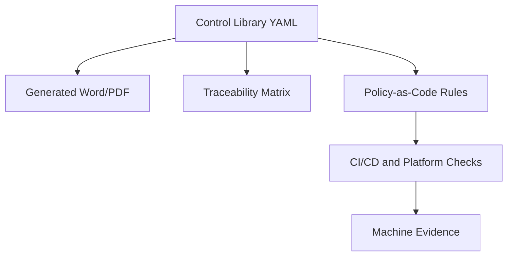

# DevSecOps Governance Framework

This repository is the central governance framework workspace for DevSecOps, governance-as-code, architecture runtime governance, machine-readable evidence, released baselines, and CI/CD platform integration.

It started with the DevSecOps Control Baseline and DevSecOps Platform Reference Architecture. It now also covers architecture governance, runtime readiness, downstream application evidence, result intake, status reporting, and CI/CD adapter patterns for GitHub Actions, Bamboo/Bitbucket, Jenkins, and GitLab CI.

The repository also models the governance stack above those standards: a `Policy` defines mandatory intent, a `Directive` defines binding operational execution, and the Standards define the detailed controls and platform expectations.

## Start Here

| Need | Entry point |
|---|---|
| Review the public adoption state | `docs/onboarding/external-review-brief.md` |
| Try the framework in an application repo | `docs/onboarding/public-repo-quickstart.md` |
| Copy ready-to-use templates | `adoption-package/README.md` |
| Inspect the validated neutral consumer | `docs/onboarding/validated-demo-consumer.md` |
| Review the current public release | `docs/releases/v0.1.0-public-adoption.md` |
| Open the published documentation | `https://joku-dev.github.io/devsecops-governance-framework/` |

## Purpose

The repository separates these concerns:

| Area | Purpose |
|---|---|
| `docs/` | Human-readable governance documentation, onboarding guides, adapter guidance, and operational explanations. |
| `docs/governance/source-documents` | Public source placeholders for lineage only; original source documents are withheld from the public repository. |
| `model/documents` | Structured catalog of policy, directive, and standard source documents. |
| `model/controls` | Structured DevSecOps control baseline requirements. |
| `model/platform` | Platform Reference Architecture levels and platform capabilities. |
| `model/traceability` | Mapping between controls, platform capabilities, evidence, and policy candidates. |
| `architecture` | Architecture runtime governance levels, markers, guardrails, review gates, and remediation actions. |
| `pipeline-baseline` | Tool-agnostic CI/CD control baseline and platform-specific adapter templates. |
| `policies/opa` | Executable policy-as-code rules for automated checks. |
| `model/evidence` | Evidence type definitions expected from pipelines and platforms. |
| `model/waivers` | Waiver model and approval authority structure. |
| `schemas` | JSON Schemas for validating structured governance data. |
| `status` | Normalized downstream governance and architecture result snapshots. |
| `generated` | Generated DOCX, PDF, HTML, and XLSX outputs. |
| `releases` | Versioned baseline packages for controlled publication. |

## Target Model

The long-term target is that structured sources become the controlled master data for software delivery governance. Word and PDF remain important output formats for reviews and audits, but original source documents are not published in this public repository.



## Initial Scope

The initial scope is based on:

- DevSecOps Control Baseline Standard aligned with Platform Levels
- DevSecOps Platform Reference Architecture Standard aligned with Control Baseline

The first implementation should focus on:

- Level 1 controls as complete structured data
- Platform Reference Architecture levels 1 to 3
- Traceability from control requirement to platform capability and expected evidence
- Initial automated checks for branch protection, SBOM, vulnerability evidence, artifact integrity, dependency source control, IaC, and waiver validity

## Runtime Governance Addendum

The repository now includes a first runtime governance addendum for the SDD Architecture Governance Framework:

- `docs/governance/architecture/runtime-governance-addendum.md`
- `architecture/quality-markers.yaml`
- `architecture/guardrails.yaml`
- `architecture/review-gates.yaml`
- `architecture/arch-l1.yaml`
- `architecture/arch-l2.yaml`
- `architecture/arch-l3.yaml`
- `architecture/arch-gov.yaml`
- `policies/opa/architecture_readiness.rego`
- `policies/opa/architecture_integration_readiness.rego`
- `policies/opa/architecture_operation_readiness.rego`
- `policies/opa/architecture_release_readiness.rego`

The addendum keeps the original framework document as the normative reference and adds machine-readable marker, guardrail, gate and policy artifacts for executable governance.

## Recommended Workflow

1. Maintain structured control and platform data in YAML.
2. Validate YAML against JSON Schemas.
3. Generate traceability views and documents from YAML.
4. Implement policy-as-code only for controls that can be objectively checked.
5. Store generated evidence from pipelines and platform checks.
6. Use waivers only as controlled, time-limited exceptions.

## Repository Layout

- `docs/` explains the governance model for people.
- `model/` contains the machine-readable governance source of truth.
- `generated/` contains rendered documents, reports, and viewer output.
- `releases/` is reserved for versioned baseline packages.
- `.github/workflows/` contains repository automation and reusable CI integration.

## Current Operational State

- `L1` is now available as a released and revision-protected baseline package via `l1-baseline-v1.1.3`.
- The current `L1 v1.1.3` package adds run-context-aware evaluation for release, pull-request, branch-validation, and diagnostic runs.
- `architecture-baseline-l1-v0.1.0` is available as the released architecture runtime governance baseline.
- GitHub Pages documentation publishing is active.
- A normalized central results index exists in `status/repository-results-index.json`.
- `ha-CPsWMS` has already been validated successfully against the central governance baseline on a protected `main` branch.
- `governance-framework-demo-consumer` is the neutral public reference consumer for first adoption validation.
- A draft CI/CD adapter model exists for extending the same governance core beyond GitHub Actions to Bamboo/Bitbucket and Jenkins.

## AI And Agent Navigation

- Agent instructions: `AGENTS.md`
- AI navigation index: `docs/ai-index.md`
- AI working rules: `docs/operations/ai-working-rules.md`

## License And Permissions

- Proprietary license notice: `LICENSE`
- Repository license and permissions: `LICENSE_AND_PERMISSIONS.md`

## Governance Change Lifecycle

- Governance change lifecycle: `docs/governance/governance-change-lifecycle.md`
- Source document register: `model/documents/source-document-register.yaml`
- Source document intake process: `docs/operations/processes/source-document-intake-process.md`
- Source document intake status: `generated/reports/source-document-intake-status.md`
- Source document intake review briefs: `generated/reports/source-document-intake-review-briefs.md`
- Source document requirement delta: `generated/reports/source-document-requirement-delta.md`
- Change request template: `docs/governance/change-requests/TEMPLATE.md`

## Local Commands

Validate repository consistency:

```bash
python scripts/validate_governance_repo.py
```

Generate the source-document intake status report:

```bash
python scripts/generate_source_document_intake_status.py
```

Generate source-document intake review briefs:

```bash
python scripts/generate_source_document_intake_review_briefs.py
```

Generate source-document requirement deltas for replacement candidates:

```bash
python scripts/generate_source_document_requirement_delta.py
```

Review the governance document hierarchy:

```bash
sed -n '1,200p' docs/governance/governance-document-hierarchy.md
```

Run the lightweight regression checks:

```bash
python -m unittest discover -s tests
```

Read the practical usage guide:

```bash
sed -n '1,240p' docs/operations/guides/how-to-use-this-repo.md
```

Read the GitHub reference path guardrails:

```bash
sed -n '1,240p' docs/operations/adapters/github-reference-path.md
```

Read the beginner step-by-step operations guide:

```bash
sed -n '1,320p' docs/operations/guides/beginner-step-by-step-operations-guide.md
```

Read how other repositories integrate this governance repository:

```bash
sed -n '1,320p' docs/onboarding/how-other-repos-use-this-governance-repo.md
```

Read the step-by-step central governance baseline integration guide:

```bash
sed -n '1,320p' docs/onboarding/how-other-repositories-use-the-central-governance-baseline.md
```

Read the application repository onboarding guide:

```bash
sed -n '1,260p' docs/onboarding/application-repo-onboarding.md
```

Use the copyable public adoption package:

```bash
sed -n '1,220p' adoption-package/README.md
```

Inspect the validated neutral demo consumer:

```bash
sed -n '1,220p' docs/onboarding/validated-demo-consumer.md
```

Read the explanation of policy, directive, baseline, verification, and governance as code:

```bash
sed -n '1,360p' docs/governance/policy-directive-baseline-verification-and-governance-as-code-explained.md
```

Read the explanation of the relationship between the control baseline and the platform architecture:

```bash
sed -n '1,320p' docs/platform/control-baseline-and-platform-architecture-relationship-explained.md
```

Use the generic GitHub Actions onboarding template:

```bash
sed -n '1,180p' examples/github-actions/workflows/application-devsecops-baseline-template.yml
```

Use the governance-input-aware onboarding template:

```bash
sed -n '1,260p' examples/github-actions/workflows/application-devsecops-baseline-with-governance-input-template.yml
```

Read the operational governance enforcement options:

```bash
sed -n '1,240p' docs/operations/processes/operational-governance-enforcement-options.md
```

Generate an extended machine-readable governance compliance result:

```bash
python3 scripts/generate_governance_compliance_result.py \
  --target-repo . \
  --input-file policies/example-input.release-candidate.json \
  --output-file governance-compliance-result.json
```

GitHub Actions runs the same core checks automatically on pushes and pull requests via `.github/workflows/governance-ci.yml`.

Generate the first traceability CSV:

```bash
python scripts/generate_traceability_csv.py
```

Generate the governance document authority matrix:

```bash
python scripts/generate_document_control_matrix.py
```

Generate the open gap report:

```bash
python scripts/generate_open_gap_report.py
```

Render the Policy and Directive into review-ready files:

```bash
python scripts/render_governance_documents.py
```

Generate the static governance status viewer:

```bash
python scripts/generate_status_viewer.py
```

Generate a control-by-control evaluation report for a specific governance run input:

```bash
python scripts/generate_control_evaluation_report.py \
  --input-file demo/inputs/release-candidate-green.json \
  --output-file generated/control-evaluation-report.json \
  --markdown-file generated/control-evaluation-report.md
```

Build the documentation site locally:

```bash
python3 -m venv .venv-docs
. .venv-docs/bin/activate
pip install -r requirements-docs.txt
mkdocs build --strict
mkdocs serve
```

Read the full step-by-step MkDocs and GitHub Pages guide:

```bash
sed -n '1,360p' docs/operations/guides/mkdocs-and-github-pages-step-by-step.md
```

Use the first versioned L1 baseline release package:

```bash
sed -n '1,240p' releases/l1/v1.0.0/baseline-package.md
sed -n '1,200p' docs/releases/l1-baseline-v1.0.0.md
```

Inspect the earlier L1 release package that introduced governance run input support:

```bash
sed -n '1,240p' releases/l1/v1.1.0/baseline-package.md
sed -n '1,220p' docs/releases/l1-baseline-v1.1.0.md
```

Inspect the current L1 release package with run-context-aware evaluation:

```bash
sed -n '1,240p' releases/l1/v1.1.3/baseline-package.md
sed -n '1,220p' docs/releases/l1-baseline-v1.1.3.md
```

Generate the central repository results index:

```bash
python3 scripts/generate_repository_results_index.py
sed -n '1,220p' status/repository-results-index.json
```

Run the local demonstration environment:

```bash
python scripts/run_demo.py
```

Generate the architecture runtime traceability CSV:

```bash
python3 scripts/generate_architecture_traceability_csv.py
```

Validate the runtime governance addendum:

```bash
python3 scripts/validate_runtime_governance.py
```

Generate a demo architecture release-readiness input for `ha-CPsWMS`:

```bash
python3 scripts/collect_architecture_release_input.py \
  --repo /workspace/ha-CPsWMS \
  --output generated/demo/ha-cpswms-architecture-release-input.json \
  --release-id ha-CPsWMS-demo \
  --baseline ha-CPsWMS-demo-baseline
```

Generate a demo architecture governance report:

```bash
python3 scripts/generate_architecture_governance_report.py \
  --input generated/demo/ha-cpswms-architecture-release-input.json \
  --output-json generated/demo/ha-cpswms-architecture-governance-report.json \
  --output-md generated/demo/ha-cpswms-architecture-governance-report.md
```

Generate a demo DevSecOps governance report:

```bash
python3 scripts/collect_devsecops_release_input.py \
  --repo /workspace/ha-CPsWMS \
  --output generated/demo/ha-cpswms-devsecops-release-input.json \
  --release-id ha-CPsWMS-demo

python3 scripts/generate_devsecops_governance_report.py \
  --input generated/demo/ha-cpswms-devsecops-release-input.json \
  --output-json generated/demo/ha-cpswms-devsecops-governance-report.json \
  --output-md generated/demo/ha-cpswms-devsecops-governance-report.md
```

By default, this is report-only. Add `--fail-on-findings` when the same check should behave as a blocking gate.

Generate the combined end-to-end demo report:

```bash
python3 scripts/generate_end_to_end_governance_report.py \
  --architecture-json generated/demo/ha-cpswms-architecture-governance-report.json \
  --devsecops-json generated/demo/ha-cpswms-devsecops-governance-report.json \
  --output-json generated/demo/ha-cpswms-end-to-end-governance-report.json \
  --output-md generated/demo/ha-cpswms-end-to-end-governance-report.md
```

Intake a downstream Architecture Runtime Governance GitHub Actions run and refresh the architecture status index:

```bash
python3 scripts/intake_architecture_github_actions_run.py \
  --repository-id joku-dev/ha-CPsWMS \
  --run-id 28588778642 \
  --architecture-baseline-ref architecture-baseline-l1-v0.1.0

python3 scripts/generate_architecture_results_index.py
python3 scripts/generate_status_viewer.py
```

The detailed live demo runbook is:

```text
docs/demos/demo-end-to-end-governance.md
```

The detailed ha-CPsWMS architecture governance result explanation is:

```text
docs/demos/ha-cpswms-architecture-governance-results.md
```

The reusable GitHub Actions template for application repositories is:

```text
pipeline-baseline/templates/github-actions/architecture-governance.yml
```

For the minimal copy-paste app-repo workflow and onboarding guide, see:

```text
pipeline-baseline/templates/github-actions/app-repo-architecture-governance.yml
pipeline-baseline/templates/github-actions/ADOPTION.md
```

Optional app-repo evidence templates are available in:

```text
pipeline-baseline/templates/app-architecture-evidence/
```

The released Architecture Runtime Governance baseline is consumed like this:

```yaml
uses: joku-dev/devsecops-governance-framework/.github/workflows/architecture-baseline-l1-v0.1.0.yml@architecture-baseline-l1-v0.1.0
with:
  solution_baseline: ha-CPsWMS-demo-baseline
  fail_on_findings: false
```

`architecture-baseline-l1-v0.1.0` is the architecture governance baseline. `ha-CPsWMS-demo-baseline` is the solution/product baseline used by the application evidence.

## Important Principle

Not every requirement should become executable policy. Some requirements are governance obligations, some are evidence obligations, and some are enforceable technical gates. The repository keeps these concerns connected but distinct.
