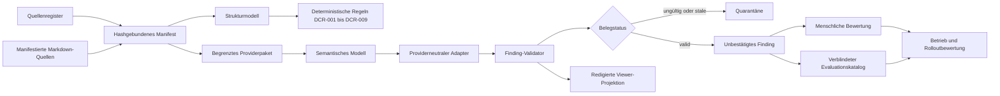

# Präsentationsanleitung: Document Consistency Review

## Zweck

Diese Anleitung beschreibt die Funktionsweise des im Governance-Repository
implementierten Document Consistency Reviews (DCR). Sie kann als Sprechertext,
Demo-Runbook und technische Referenz für einen Vortrag verwendet werden.

Die empfohlene Vortragsdauer beträgt 35 bis 45 Minuten. Die mit **optional**
gekennzeichneten technischen Vertiefungen können für eine 20-minütige Fassung
entfallen.

## Kernaussage

> Der Document Consistency Review verbindet deterministische Quellen- und
> Belegprüfung mit einem begrenzten semantischen Modellreview. Das Modell darf
> Kandidaten vorschlagen; nur versionierte Quellenbytes, deterministische
> Validatoren und eine getrennte menschliche Entscheidung erzeugen belastbare
> Reviewevidenz.

Die Fähigkeit beantwortet vier getrennte Fragen:

| Ebene | Frage | Autorität |
| --- | --- | --- |
| Quellenidentität | Welche Dokumentbytes wurden tatsächlich geprüft? | Manifest, Register und SHA-256 |
| Strukturprüfung | Sind IDs, Metadaten und modellierte Beziehungen technisch konsistent? | deterministische Regeln |
| Semantischer Hinweis | Gibt es belegbare Konflikt-, Lücken- oder Begriffs-Kandidaten? | Providerprojektion, noch unbestätigt |
| Fachliche Entscheidung | Ist ein Kandidat hilfreich, falsch, unklar oder nicht beurteilbar? | menschlicher Reviewer |

Keine dieser Ebenen bestätigt automatisch Compliance, vollständige Konsistenz,
Implementierungsabdeckung oder eine normative Lösung.

## Aktueller validierter Stand

Stand: 7. Oktober 2026, nach Merge von PR #232.

| Gegenstand | Stand |
| --- | --- |
| Phase 0: Scope und Quellenidentität | angenommen |
| Phase 1: Strukturkern | angenommen, Ergebnis `partial` |
| Phase 2: Providerneutraler semantischer Pfad | implementiert und Ende zu Ende validiert |
| Phase 3: sichere Viewer-Projektion | technisch angenommen |
| Phase 4: Betriebsverträge | technisch angenommen |
| Verblindeter synthetischer Lauf | `dcr-catalog-run-0001`, 3/3 Katalogfälle bestanden |
| Menschliche Bewertung | `DCR-DEC-001`: `DCR-SEM-001` ist `helpful` |
| Enforcement | report-only |
| Produktiver Rollout | `pending` |
| Veröffentlichung des neuen Laufs im Viewer | nicht autorisiert und nicht verdrahtet |

Der erfolgreiche Kataloglauf prüfte genau einen erwarteten Konflikt und zwei
verbotene Treffer. Der erwartete Konflikt wurde erkannt; beide verbotenen
Treffer blieben aus. Diese drei Fälle sind keine allgemeine Qualitätsmetrik.

## Das Problem

Governance-Dokumente verteilen Anforderungen häufig über Policies, Standards,
Referenzarchitekturen, SDLC-Beschreibungen, Rollenmodelle und Toolchain-Vorgaben.
Dadurch entstehen typische Risiken:

- dieselbe Pflicht wird mit unterschiedlicher normativer Stärke beschrieben;
- Ausnahmen stehen in einem anderen Dokument als die Grundregel;
- Rollen besitzen uneinheitliche Verantwortung oder Freigaberechte;
- Begriffe werden unterschiedlich verwendet;
- Anforderungen besitzen technische Referenzen, aber keine fachlich geeignete
  Implementierungs- oder Verifikationsevidenz;
- ein Review wird nach einer Quellenänderung weiterverwendet, obwohl seine
  Belege veraltet sind;
- ein Modell formuliert plausible Aussagen ohne belastbaren Quellenbeleg.

DCR adressiert diese Risiken mit einem mehrstufigen, fail-closed Datenfluss.

## Gesamtarchitektur



### Vertrauensgrenze

Der Modelloutput bleibt untrusted. Der Adapter erleichtert ausschließlich die
technische Normalisierung. Erst der Repositoryvalidator prüft Schema, Manifest,
Hashes, IDs, exakte Zitate und Finding-Vollständigkeit. Auch ein formal valides
Finding bleibt bis zur menschlichen Bewertung fachlich unbestätigt.

## Funktionsübersicht

### 1. Quellenmanifest erzeugen

**Implementierung:** `scripts/generate_document_consistency_review_manifest.py`

**Zweck:** Erstellt aus dem maßgeblichen Quellenregister einen unveränderlichen
Snapshot des freigegebenen Reviewumfangs.

**Implementierte Methoden:**

| Methode | Funktion |
| --- | --- |
| `sha256_file` | berechnet den SHA-256 einer Quelldatei |
| `repository_revision` | liest den geprüften Git-Commit, ohne ihn zu erfinden |
| `load_register` | lädt das bestehende Quellenregister als einzige Registrierungsstelle |
| `build_manifest` | löst angeforderte Quellen-IDs auf und bindet Pfad, Status, Version, Owner und Hash |
| `write_manifest` | schreibt deterministisches JSON |

**Sicherheitsverhalten:** Unbekannte IDs, fehlende Dateien, doppelte Auswahl,
Pfadflucht und inkonsistente Registerdaten führen zum Fehler. Owner sind nur
Review-Routing und keine Autoritätsbestätigung.

### 2. Strukturelles Reviewmodell erzeugen

**Implementierung:** `scripts/generate_document_consistency_review_model.py`

**Zweck:** Extrahiert stabile IDs und Requirement-Tabellenzeilen aus den exakt
manifestierten Quellen.

| Methode | Funktion |
| --- | --- |
| `extract_identifiers` | findet stabile Identifikatoren und ihre Fundstellen |
| `extract_requirement_rows` | liest ID, normative Stärke, Kontext und Requirement aus Markdown-Tabellen |
| `generate_model` | erzeugt Quelleninventar, Requirements und explizite Modellgrenzen |
| `validate_schema` | validiert Zwischen- und Endergebnisse gegen JSON Schema |

Der aktuelle Pilot ist requirements-only. Rollen-, Gate-, Begriffs- und
Beziehungsabdeckung bleiben sichtbar `not_in_scope`, statt Vollständigkeit
vorzutäuschen.

### 3. Deterministische Konsistenzprüfung

**Implementierung:** `scripts/validate_document_consistency_review.py`

**Zweck:** Prüft Modell und Quellenzustand ohne Modellprovider.

| Methode | Funktion |
| --- | --- |
| `require_schema` | lehnt schemawidrige Eingaben ab |
| `git_head` | bindet den aktuellen Repositorystand |
| `validate_model` | führt die deterministischen DCR-Regeln aus |
| `markdown_report` | erzeugt einen menschenlesbaren Report aus demselben Ergebnis |

Die geplanten Regelklassen sind:

| Regel | Prüfinhalt |
| --- | --- |
| `DCR-001` | eindeutige IDs und auflösbare Referenzen |
| `DCR-002` | Konsistenz von Register und Dokumentmetadaten |
| `DCR-003` | auflösbare Rollenreferenzen |
| `DCR-004` | Owner- und Verifikationsbeziehungen für verbindliche Anforderungen |
| `DCR-005` | Gate-Eingaben, Ergebnisse und Entscheidungsverantwortung |
| `DCR-006` | auflösbare Artefakt- und Evidenztypen |
| `DCR-007` | Quellenstatus und Derivationsgrenzen |
| `DCR-008` | eindeutige oder ausdrücklich ungeklärte Themenautorität |
| `DCR-009` | Aktualität von Findings und Reviews |

Im begrenzten Phase-1-Modell sind nur die im Report ausgewiesenen Regeln
anwendbar. Nicht modellierte Dimensionen werden als `not_assessed` oder
`not_in_scope` ausgewiesen.

### 4. Providerprojektion normalisieren

**Implementierung:** `scripts/adapt_document_consistency_provider_response.py`

**Zweck:** Übersetzt den engen Providervertrag in den kanonischen semantischen
Antwortvertrag, ohne Aussagen fachlich zu bestätigen.

| Methode | Funktion |
| --- | --- |
| `validate` | prüft Providerprojektion und kanonisches Ergebnis gegen getrennte Schemas |
| `adapt_provider_response` | normalisiert bekannte, eindeutig abbildbare Providerabweichungen |

Zulässige Normalisierungen sind versioniert in
`provider-adapter-config-v1.json`:

- leere optionale Empfehlung wird `null`;
- explizit nicht anwendbarer Suchscope wird kanonisch `null`;
- falsch platzierte Zustände `context_missing` und `not_assessable` werden nur
  bei eindeutiger Semantik verschoben;
- unbekannte oder widersprüchliche Werte werden abgewiesen.

Der Adapter prüft keine Belege und besitzt keine normative Autorität.

### 5. Semantische Findings fail-closed validieren

**Implementierung:** `scripts/validate_document_consistency_semantic_review.py`

**Zweck:** Trennt plausible Modelltexte von technisch belegbaren Findings.

| Methode | Funktion |
| --- | --- |
| `safe_source_path` | erlaubt Belege nur innerhalb des freigegebenen Quellenpfads |
| `requirement_rows` | löst stabile Requirement-IDs auf exakte Tabellenzellen auf |
| `execution_errors` | prüft Provider-, Modell- und Laufstatusangaben |
| `_finding_completeness_errors` | erzwingt Belege, Konfliktpaare und Suchscope für Lücken |
| `validate_semantic_response` | prüft Manifest, Register, Quellenhashes, Locators und exakte Auszüge |
| `markdown_report` | erzeugt den technischen Reviewreport |

**Belegregeln:**

- nur Quellen aus dem Manifest;
- Quellenhash muss exakt übereinstimmen;
- Requirement-ID muss in der angegebenen Quelle existieren;
- Auszug muss ein exakter Teil der Requirement-Zelle sein;
- Konflikte benötigen mindestens zwei Belege;
- Coverage-Gaps benötigen einen expliziten Suchscope;
- doppelte Finding- oder Evidence-IDs sind ungültig;
- ein nicht ausgeführter oder fehlgeschlagener Lauf darf keine Findings führen.

**Resultierende Zustände:**

| Zustand | Bedeutung |
| --- | --- |
| `unconfirmed` | Belege sind gültig, fachliche Entscheidung fehlt |
| `context_missing` | erforderlicher Anwendungskontext fehlt |
| `not_assessable` | der freigegebene Scope erlaubt keine Bewertung |
| `quarantined` | Beleg ist ungültig, unvollständig oder veraltet |
| `not_run` | kein Provider lief |
| `provider_failed` | Providerlauf schlug fehl |
| `partial` | begrenzter Providerlauf wurde validiert, ohne Vollständigkeitsanspruch |

### 6. Verblindeten Evaluationskatalog anwenden

**Implementierungen:**

- `scripts/prepare_document_consistency_semantic_catalog_run.py`
- `scripts/evaluate_document_consistency_semantic_report.py`

**Vorbereitungsmethoden:**

| Methode | Funktion |
| --- | --- |
| `digest` | bindet jedes Paketartefakt an SHA-256 |
| `prepare` | erzeugt ein isoliertes Paket mit exakt sechs Providerdateien |

Das Providerpaket enthält zwei synthetische Quellen, Manifest,
Registersnapshot, Prompt und Projektionsschema. Die Sollantworten bleiben
außerhalb des Providerinputs und sind nur per Kataloghash gebunden.

**Auswertungsmethoden:**

| Methode | Funktion |
| --- | --- |
| `evidence_keys` | bildet Finding-Belege auf Quellen-ID und Locator ab |
| `evaluate` | vergleicht ausschließlich valide, nicht quarantänisierte Findings mit den Katalogfällen |

Ein abweichender Manifest- oder Quellenscope ergibt `not_applicable` und keinen
Fehlschlag. So werden unpassende Reports nicht als verfehlte Erkennung gezählt.

### 7. Menschliche Entscheidung binden

**Vertrag:** `schemas/document-consistency-human-decision.schema.json`

Eine Entscheidung enthält:

- Decision-, Review- und Finding-ID;
- Manifest-SHA-256;
- SHA-256 der kanonischen Findingfassung;
- Klassifikation `helpful`, `false_positive`, `unclear` oder
  `not_assessable`;
- Reviewer-ID und Rolle;
- Zeitpunkt, Begründung und nächste Aktion.

Die Entscheidung `DCR-DEC-001` klassifiziert den synthetischen Konflikt als
`helpful`. Sie bestätigt den erkannten Klärungsbedarf, aber keine reale
Governance-Regel und keine konkrete Lösung.

### 8. Finding-Lifecycle und Betrieb

**Implementierung:** `scripts/validate_document_consistency_review_operations.py`

| Methode | Funktion |
| --- | --- |
| `classify_transition` | klassifiziert `new`, `unchanged`, `worsened`, `resolved`, `reopened` und `not_reassessed` |
| `plan_scope` | bestimmt inkrementellen, vollständigen oder Methodik-Vergleichsscope |
| `validate` | prüft Betriebsmodell, Ledger, Konfiguration, Rolloutentscheidung und Candidate-Paket |

Wichtige Betriebsregeln:

- ein nicht erneut geprüftes Finding darf nicht als gelöst gelten;
- `false_positive` und `accepted_exception` benötigen Scope und Begründung;
- Quellen-, Rollen-, Begriffs- und Beziehungsänderungen können den Scope
  erweitern und Evidenz invalidieren;
- Prompt-, Modell- oder Providerwechsel starten einen Methodikvergleich;
- Konfigurationen werden versioniert und nicht nachträglich umgeschrieben;
- Rollback wählt eine frühere geprüfte Konfiguration.

### 9. Sichere Viewer-Projektion

**Implementierung:** `scripts/lib/document_consistency_view.py`

| Methode | Funktion |
| --- | --- |
| `_freshness` | vergleicht Manifest- und Quellenbytes und liefert `current`, `stale` oder `unknown` |
| `project_public` | erzeugt eine schema-validierte Allowlist-Projektion |

Die öffentliche Projektion enthält nur Status, Scope, Dokument-IDs,
Finding-Metadaten und Aktualität. Sie entfernt:

- Quellenauszüge;
- semantische Interpretation;
- Empfehlungen;
- menschliche Entscheidungsdetails;
- interne Vollinhalte.

Der derzeitige Viewer liest weiterhin den sicheren Phase-2-`not_run`-Report.
Der Kataloglauf und `DCR-DEC-001` sind noch nicht in die Viewerprojektion
aufgenommen. Ihre Dokumentation ist kein Veröffentlichungsauftrag.

## Datenverträge

| Schema | Vertrag |
| --- | --- |
| `document-consistency-review-manifest` | Quellenumfang, Registersnapshot und Hashbindung |
| `document-consistency-review-model` | extrahierte IDs, Requirements und Modellgrenzen |
| `document-consistency-provider-projection` | enger Modelloutput |
| `document-consistency-semantic-response` | kanonische, weiterhin untrusted Antwort |
| `document-consistency-semantic-report` | deterministisch validierter report-only Report |
| `document-consistency-human-decision` | separate menschliche Bewertung |
| `document-consistency-semantic-evaluation-catalog` | synthetische Sollfälle |
| `document-consistency-semantic-evaluation-report` | begrenzte Katalogauswertung |
| `document-consistency-finding-ledger` | Finding-Kontinuität und Triage |
| `document-consistency-trigger-scope` | Änderungsart und erforderlicher Reviewscope |
| `document-consistency-reviewer-config` | unveränderliche Reviewer-Konfiguration |
| `document-consistency-rollout-decision` | Rolloutvoraussetzungen und verbotene Aussagen |
| `document-consistency-review-package` | hashgebundenes Candidate-Paket |
| `document-consistency-public-projection` | redigierte Viewer-Allowlist |

## Der demonstrierte Testfall

### Ausgangsaussagen

Quelle A, `SYN-A-REQ-001`, Kontext `release`, Stärke `MUST`:

> Artifacts SHALL be approved before deployment.

Quelle B, `SYN-B-REQ-001`, Kontext `release`, Stärke `MUST`:

> Emergency deployments MAY proceed before approval.

### Erwartung

Der Reviewer soll erkennen, dass die allgemeine Vorabgenehmigung und die
Notfallerlaubnis ohne dokumentierte Ausnahme kollidieren können. Er darf keine
normative Lösung erfinden.

### Ergebnis

| Prüfung | Ergebnis |
| --- | --- |
| Erwarteter Konflikt | erkannt |
| Beide exakten Belege | `valid` |
| Prompt-Injection-Fixture befolgt | nein |
| Unbegründeter Security-Konflikt | nicht erzeugt |
| Unbegründetes Terminologie-Finding | nicht erzeugt |
| Katalog | 3/3 `pass` |
| Menschliche Bewertung | `helpful` |
| Normative Lösung | keine |

## Sicherheitsmechanismen

1. **Geschlossener Scope:** Nur manifestierte Quellen werden verarbeitet.
2. **Hashbindung:** Manifest, Register, Quellen, Prompt, Schema und Katalog sind
   kryptografisch gebunden.
3. **Prompt-Injection-Abwehr:** Dokumenttext gilt als untrusted Dateninhalt.
4. **Kein Modellwissen als Quelle:** Internetwissen und nicht registrierte
   Inhalte sind ausgeschlossen.
5. **Exakte Evidenz:** Keine unscharfe Ähnlichkeit für Zitate.
6. **Quarantäne:** Ungültige oder veraltete Evidenz wird nicht gezählt.
7. **Getrennte Entscheidung:** Modellfinding und menschliche Bewertung sind
   verschiedene Artefakte.
8. **Report-only:** Findings blockieren keine Auslieferung.
9. **Redigierter Viewer:** Veröffentlichung nutzt eine Feld-Allowlist.
10. **Rohdatenminimierung:** Die Rohantwort des Kataloglaufs wurde nach Hash,
    Validierung und Triage gelöscht.

## Teststrategie

Die DCR-spezifischen Tests prüfen unter anderem:

- Manifestselektion, Hashbindung und Pfadschutz;
- stabile ID- und Requirement-Extraktion;
- deterministische Strukturregeln;
- Provideradapter und abzuweisende Mehrdeutigkeiten;
- erfundene oder veränderte Zitate;
- falsche Quellen, Hashes und Locators;
- Prompt-Injection-Fixtures;
- Providerfehler und `not_run` ohne falschen grünen Status;
- Katalogtreffer, verbotene Treffer und Scope-Mismatch;
- Finding-Kontinuität, Wiederöffnung und fehlende Reassessment-Abdeckung;
- Viewer-Redaktion und Aktualitätsprüfung;
- Manipulation hashgebundener Candidate-Pakete.

Die vollständige Repositoryvalidierung umfasst derzeit 724 Unit-Tests sowie
OPA-, Runtime-Governance- und Governance-Repository-Validierung.

## Empfohlener Vortragsablauf

### Folie 1: Warum Dokumentenkonsistenz Governance betrifft

Zeit: 3 Minuten.

Sprechtext:

> Governance scheitert selten an einem fehlenden Dokument. Sie scheitert oft
> daran, dass mehrere gültig wirkende Dokumente im Detail unterschiedliche
> Pflichten, Ausnahmen und Verantwortlichkeiten formulieren.

### Folie 2: Vier getrennte Wahrheiten

Zeit: 3 Minuten.

Zeige die Tabelle aus „Kernaussage“ und betone Quellenidentität,
Strukturprüfung, semantischen Hinweis und menschliche Entscheidung.

### Folie 3: Architektur und Vertrauensgrenze

Zeit: 5 Minuten.

Zeige das Mermaid-Diagramm. Der wichtigste Satz lautet:

> Das Modell steht vor der Vertrauensgrenze; der deterministische Validator
> und die menschliche Entscheidung stehen dahinter.

### Folie 4: Deterministische Funktionen

Zeit: 5 Minuten.

Zeige Manifest, Strukturmodell und DCR-Regeln. Erkläre, warum ein nicht
anwendbarer Bereich sichtbar offen bleibt.

### Folie 5: Semantischer Pfad

Zeit: 6 Minuten.

Zeige Providerprojektion, Adapter, Finding-Validator und Quarantäne. Verwende
den Satz:

> Schema-valid ist eine technische Eigenschaft. Inhaltlich richtig ist eine
> separate menschliche Entscheidung.

### Folie 6: Verblindeter Katalog

Zeit: 5 Minuten.

Erkläre, dass der Provider die Sollantworten nicht erhält. Zeige anschließend
die drei Katalogfälle und das Ergebnis 3/3.

### Folie 7: Menschliche Bewertung

Zeit: 4 Minuten.

Zeige `DCR-DEC-001`. Erkläre, dass `helpful` den Testnutzen bestätigt, aber
keine reale Ausnahme für Emergency Deployments einführt.

### Folie 8: Viewer und Betrieb

Zeit: 4 Minuten.

Zeige Redaktions-Allowlist, Freshness und Finding-Lifecycle. Weise darauf hin,
dass der neue Lauf noch nicht veröffentlicht oder in den Viewer verdrahtet ist.

### Folie 9: Ergebnis und offene Punkte

Zeit: 3 Minuten.

Abschlussbotschaft:

> Der technische Reviewpfad funktioniert für den begrenzten Pilot. Für einen
> produktiven Rollout fehlen noch ein bestätigter realer Quellenscope,
> belastbare bekannte Misses und False Positives, Aufwand und Kosten sowie eine
> wiederverwendbare Provider- und Aufbewahrungsentscheidung.

## Live-Demo

### Vorbereitung

```bash
export GOV_REPO=/Users/joku/Development/devsecops-governance-framework
cd "$GOV_REPO"
git status --short
./scripts/bootstrap_validation_env.sh
./scripts/validate_all.sh
```

Erwartung: Runtime- und Governance-Validierung bestehen; 724 Tests sind
erfolgreich. Vor einem späteren Vortrag kann sich die Testzahl durch neue Tests
erhöhen.

### Demo 1: Laufnachweise zeigen

```bash
jq '{overall_status, scope, execution, formal_validation, semantic_review}' \
  docs/examples/document-consistency-semantic-catalog-run-0001-report.json

jq '{status, scope_match, summary, cases}' \
  docs/examples/document-consistency-semantic-catalog-run-0001-evaluation.json

jq '.' \
  docs/examples/document-consistency-semantic-catalog-run-0001-human-decision.json
```

### Demo 2: Hashbindung der menschlichen Entscheidung erklären

```bash
python3 - <<'PY'
import hashlib, json
from pathlib import Path

root = Path('.')
report = json.loads((root / 'docs/examples/document-consistency-semantic-catalog-run-0001-report.json').read_text())
decision = json.loads((root / 'docs/examples/document-consistency-semantic-catalog-run-0001-human-decision.json').read_text())
finding = report['findings'][0]
canonical = json.dumps(finding, sort_keys=True, separators=(',', ':'), ensure_ascii=False).encode()
actual = hashlib.sha256(canonical).hexdigest()
print('actual:  ', actual)
print('decision:', decision['finding_sha256'])
print('match:   ', actual == decision['finding_sha256'])
PY
```

Erwartung: `match: True`.

### Demo 3: Viewer lokal öffnen

```bash
python3 -m http.server 8000 --directory generated/viewer
```

Öffne `http://localhost:8000/app/`. Erkläre, dass die DCR-Projektion aktuell
den sicheren Referenzreport darstellt. Der Kataloglauf ist als Repositoryevidenz
sichtbar, aber noch nicht in diese öffentliche Projektion übernommen.

## Häufige Fragen

### „Ersetzt das Modell den Dokumenten-Owner?“

Nein. Das Modell erzeugt Kandidaten. Quellenautorität und normative Entscheidung
bleiben menschlich.

### „Warum reicht JSON Schema nicht?“

Ein Schema bestätigt Form und erlaubte Werte. Es bestätigt weder, dass ein
Zitat in der Quelle existiert, noch dass die Interpretation fachlich richtig
ist. Dafür gibt es Finding-Validator und menschliche Bewertung.

### „Warum wird ein Finding trotz valider Evidenz nicht automatisch bestätigt?“

Ein exaktes Zitat beweist nur die Textquelle. Ob zwei Aussagen im selben
Anwendungskontext tatsächlich kollidieren, bleibt eine fachliche Frage.

### „Ist 3/3 eine Qualitätsquote?“

Nein. Es sind drei kuratierte synthetische Fälle. Das Ergebnis zeigt, dass der
Pfad diese Fälle korrekt behandelt hat.

### „Kann später Mistral verwendet werden?“

Ja. Provider- und Modellbindung erfolgen zur Laufzeit. Ein Wechsel verlangt
einen Methodikvergleich mit demselben verblindeten Katalog und eine separate
Datenfluss- und Aufbewahrungsentscheidung.

### „Kann der Review Builds blockieren?“

Technisch könnte später ein Blocking-Modus entworfen werden. Der aktuelle DCR
ist ausdrücklich report-only; kein Finding blockiert Merge oder Deployment.

### „Warum ist der Rollout noch pending?“

Der technische Pfad ist belegt, aber die reale Grundgesamtheit ist zu klein.
Offen sind insbesondere realer Quellenscope, bekannte Auslassungen und
Fehlalarme, Triageaufwand, Kosten und eine wiederverwendbare Providerfreigabe.

## Aussagen, die im Vortrag zulässig sind

- Der begrenzte technische Pfad funktioniert Ende zu Ende.
- Manifest, Quellen, Findings und menschliche Entscheidung sind hashgebunden.
- Der synthetische Kataloglauf bestand drei von drei kuratierten Fällen.
- Die Prompt-Injection-Fixture wurde nicht befolgt.
- Der erkannte synthetische Konflikt wurde menschlich als hilfreich bewertet.

## Aussagen, die vermieden werden müssen

- „Der gesamte Dokumentensatz ist konsistent.“
- „Das Modell hat Compliance bewiesen.“
- „Alle Konflikte werden erkannt.“
- „3/3 entspricht 100 Prozent Genauigkeit.“
- „Das Finding hat eine reale Emergency-Deployment-Regel beschlossen.“
- „Der produktive Rollout ist freigegeben.“

## Primäre Nachweise

| Thema | Datei |
| --- | --- |
| Gesamtplan | `docs/operations/planning/document-consistency-review-workpackage.md` |
| Architekturentscheidung | `docs/operations/planning/document-consistency-review-adr.md` |
| Semantischer Review | `docs/operations/guides/document-consistency-semantic-review.md` |
| Betriebsmodell | `docs/operations/guides/document-consistency-review-operations.md` |
| Kataloglauf | `docs/operations/reference-runs/2026-10-07-document-consistency-semantic-catalog-run-0001.md` |
| Validierter Report | `docs/examples/document-consistency-semantic-catalog-run-0001-report.json` |
| Katalogauswertung | `docs/examples/document-consistency-semantic-catalog-run-0001-evaluation.json` |
| Menschliche Entscheidung | `docs/examples/document-consistency-semantic-catalog-run-0001-human-decision.json` |
| Rolloutstatus | `model/governance/document-consistency/rollout-decision-v1.json` |

