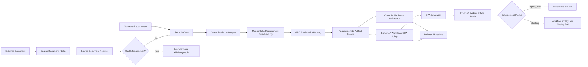

# Architektur vom Dokumenteingang bis zum ausführbaren OPA-Regelwerk

## Zweck und Geltungsbereich

Dieses Dokument beschreibt den vollständigen Governance-Datenfluss von einem
eingehenden normativen Dokument bis zu ausführbaren Regeln für Open Policy
Agent (OPA). Es beschreibt den Sollprozess und den derzeit implementierten
Stand des Repositories.

Das OPA-Regelwerk ist der automatisierbare Teil des Governance-Systems. Im
Zielzustand besteht die vollständige normative Wahrheit aus den aktiven
kanonischen Requirements im Git-Repository. Während der Mischphase bleiben
freigegebene Eingangsdokumente für noch nicht migrierte Anforderungen
normativ. Anforderungen, die menschliches Urteil benötigen, werden durch
Reviews, Evidenzanforderungen oder Freigaben umgesetzt und nicht künstlich in
eine boolesche OPA-Regel übersetzt.

## Architekturüberblick



Die Kette ist absichtlich in Entscheidungen getrennt. Die Freigabe einer
Quelle genehmigt noch keine einzelne Anforderung. Die Aktivierung eines
Requirements genehmigt noch keine konkrete OPA-Implementierung. Ein
Blocking-Modus benötigt zusätzlich eine eigene Enforcement-Freigabe.

## 1. Eingang und Klassifizierung eines Dokuments

### 1.1 Ablage

Ein normatives Eingangsdokument oder ein kontrollierter Requirements-Auszug
wird unter `docs/governance/source-documents/` abgelegt. Private
Originaldokumente können außerhalb des Repositories verbleiben; dann wird ein
bereinigter, eindeutig versionierter Requirements-Auszug eingecheckt.

Vor der Nutzung wird das Artefakt nach dem New Artifact Intake Process
klassifiziert. Dadurch wird verhindert, dass beispielsweise ein Bericht, ein
Evidenzresultat oder eine erläuternde Dokumentation irrtümlich als normative
Quelle behandelt wird.

### 1.2 Registrierung

Jede Quelle erhält in
`model/documents/source-document-register.yaml` mindestens:

- eine stabile Source-ID,
- Pfad, Version und Eigentümer,
- Governance-Domänen,
- Intake- und Freigabestatus,
- Beziehungen zu Vorgänger- oder Ersatzdokumenten,
- die grundsätzlich betroffenen Artefaktbereiche.

Unklare, überlappende oder möglicherweise ersetzende Quellen beginnen als
`candidate`. Dieser Status erlaubt Vergleich, Analyse und Review, aber keine
Ableitung von Controls, Architekturregeln, OPA-Policies, Schemas, Workflows
oder Releases.

### 1.3 Intake Review

Der Intake erzeugt reproduzierbare Entscheidungsgrundlagen:

- Intake-Status,
- Review Brief,
- Requirement Delta zu möglichen Vorgängern,
- Change Impact Report,
- bei Architekturquellen eine Source Replacement Assessment.

Ein Mensch mit der passenden Rolle entscheidet anschließend, ob die Quelle
neu, verwandt, dupliziert, ersetzend, superseded oder retired ist. Die
Entscheidung wird in einem Governance Change Request unter
`docs/governance/change-requests/` versioniert. Erst eine freigegebene Quelle
darf in den Requirement Lifecycle eingehen.

## 2. Autorität während der Mischphase

`model/requirements/requirement-authority-ledger.yaml` steuert pro Quelle,
welche Darstellung normativ ist. Der Speicherort allein ändert keine
Autorität.

| Modus | Bedeutung |
|---|---|
| `external_authoritative` | Das externe beziehungsweise registrierte Dokument ist die normative Quelle. |
| `migration_in_progress` | Aktivierte Requirements gelten in Git; für noch offene Requirements bleibt das Dokument normativ. |
| `git_authoritative` | Alle Requirements der Quelle wurden entschieden und aktiviert; Git ist die normative Wahrheit. |
| `retired` | Die Quelle wird für neue Ableitungen nicht mehr verwendet; ihre Historie bleibt erhalten. |

Der Ledger bindet den Zustand an den SHA-256-Fingerprint des Dokuments und
führt `total`, `analyzed`, `decided`, `effective` und `unresolved`. Der Wechsel
zu `git_authoritative` ist erst erlaubt, wenn die Abdeckung vollständig ist
und `complete-migration` eine Katalogfreigabe dokumentiert.

## 3. Zerlegung in Requirement Proposals

Für eine freigegebene Dokumentquelle erzeugt `import-source` einen Lifecycle
Case unter `model/requirements/lifecycle-cases/`. Jede extrahierte Anforderung
wird zu einem einzeln entscheidbaren Proposal. Intake-Daten und spätere
Entscheidungen bleiben als append-only Historie erhalten.

Der Analyseprozess vergleicht das Proposal deterministisch mit dem vorhandenen
Katalog. Er schlägt passende bestehende Requirements, eine Klassifikation und
einen Confidence-Wert vor. Diese Analyse unterstützt die Moderation, besitzt
aber keine Entscheidungsbefugnis.

Die zulässigen fachlichen Entscheidungen sind:

| Klassifikation | Wirkung bei Freigabe |
|---|---|
| `new` | Erzeugt ein neues kanonisches Requirement. |
| `duplicate` | Verweist auf ein bestehendes oder im selben Fall aktiviertes Requirement; erzeugt kein zweites Requirement. |
| `extend` | Erzeugt ein eigenständiges Requirement mit Beziehung zum erweiterten Requirement. |
| `change` | Erzeugt eine neue Revision und beendet die Gültigkeit der vorherigen Revision. |
| `supersede` | Erzeugt eine neue Revision beziehungsweise Nachfolge und schließt den ersetzten Stand. |
| `conflict` | Blockiert Aktivierung und Ableitung bis zur fachlichen Auflösung. |

Die menschliche Entscheidung enthält Entscheider, Rolle, Begründung,
Entscheidungsreferenz und die erlaubten Ableitungsarten. Damit werden
inhaltliche Annahme und technische Verwendung gemeinsam nachvollziehbar.

## 4. Aktivierung im kanonischen Requirement-Katalog

`activate` schreibt ein freigegebenes Proposal als `GRQ-xxxxxx@revN` nach
`model/requirements/governance-requirement-catalog.yaml`. Eine aktive Revision
enthält unter anderem:

- normativen Text und Stärke,
- Domäne und Eigentümer,
- Gültigkeitszeitraum,
- genaue Source-Requirement-Referenzen,
- Beziehungen zu anderen Requirements,
- Entscheidungsreferenz,
- `authorized_derivations`,
- den freigegebenen Runtime-Enforcement-Modus.

Alte Revisionen werden nicht überschrieben. Eine Änderung erzeugt eine neue
Revision; `active_revision` zeigt auf den aktuellen Stand. Ein Lifecycle Case
kann `partially_activated` sein: freigegebene Proposals werden wirksam,
während offene Proposals derselben Dokumentquelle weiterhin durch das
Ursprungsdokument autorisiert bleiben.

Git-native Anforderungen starten über eine versionierte Markdown-Quelle unter
`docs/governance/requirements/native-sources/` und `start-native`. Danach
durchlaufen sie dieselbe Analyse, Entscheidung, Aktivierung und
Artefaktableitung. Sie benötigen keinen Dokumentmigrations-Ledger, weil sie
bereits nativ in Git entstehen.

## 5. Vom Requirement zum Governance-Artefakt

Ein aktives GRQ Requirement erzeugt nicht automatisch Code. Zuerst wird
entschieden, welche Umsetzung fachlich geeignet ist. Mögliche Artefakttypen
sind Dokumentation, Controls, Plattformmodelle, Architekturregeln, Policies,
Schemas, Workflows und Releases.

Die n:m Zuordnung steht in
`model/requirements/requirement-to-artifact-register.yaml`. Jeder Eintrag
verbindet eine **exakte** GRQ Revision mit einem konkreten Artefakt und enthält:

- Source-Requirement-Referenzen,
- Artefaktpfad, Typ und fachliche Artefakt-ID,
- SHA-256 des übernommenen oder abgeleiteten Artefakts,
- Beziehung wie `implements`, `enforces` oder `supports`,
- Entscheidungstyp `adoption` oder `derivation`,
- Entscheider, Rolle, Zeitpunkt und Entscheidungsreferenz,
- Ergebnis der Gleichwertigkeitsprüfung und deren Evidenz,
- Enforcement-Modus `none`, `report_only` oder `blocking`.

`adoption` übernimmt eine bereits vorhandene Implementierung nach bestätigter
inhaltlicher Gleichwertigkeit. `derivation` dokumentiert die kontrollierte
Neuerstellung oder Änderung aus dem aktiven Requirement. Ein Requirement kann
mehrere Artefakte autorisieren; ein Artefakt kann mehrere Requirements
umsetzen.

## 6. Ableitung von Controls und OPA-Policies

Controls bilden die fachliche Kontrollstruktur, stabile Runtime-IDs,
Evidenzerwartungen und Maturity-Zuordnung ab. OPA-Policies implementieren nur
die objektiv maschinenprüfbaren Bedingungen daraus.

Die Ableitung einer OPA-Policy umfasst:

1. Das Requirement muss als genaue aktive `GRQ-*` Revision existieren.
2. Seine `authorized_derivations` müssen `policies` enthalten.
3. Fachliche Bedingung, benötigte Eingabedaten und erwartete Findings werden
   festgelegt.
4. Die Rego-Regel wird unter `policies/opa/` erstellt oder angepasst.
5. Repräsentative Inputs prüfen positive, negative und Ausnahmefälle.
6. Ein fachlicher Review bestätigt die Gleichwertigkeit zwischen GRQ Revision
   und Rego-Verhalten.
7. Ein RTA-Eintrag bindet die Revision an Pfad und SHA-256 der Policy.
8. Eine getrennte Entscheidung setzt den Betriebsmodus.

Der Artefakt-Hash macht die Freigabe inhaltsgebunden. Ändert sich die
Rego-Datei, stimmt der Hash nicht mehr und die Validierung verlangt eine neue
Ableitungsentscheidung. Eine bloße Pfadreferenz kann daher keine nachträgliche
inhaltliche Änderung autorisieren.

## 7. Funktionsweise von OPA zur Laufzeit

OPA erhält zwei getrennte Eingaben:

- **Policy Data:** die versionierte Rego-Logik aus `policies/opa/`,
- **Runtime Input:** normalisierte Fakten aus Repository, Pipeline, Scannern,
  Architekturassessments oder Evidenzsammlern.

Die Adapter und Collectors übersetzen anbieterspezifische Daten in stabile
JSON-Verträge. Dadurch bleibt eine Policy unabhängig davon, ob die Fakten
beispielsweise aus GitHub, GitLab, Jenkins, Azure DevOps, SonarQube oder einem
Artefakt-Repository stammen.

Ein typischer Ablauf ist:

```text
Plattform- und Scanner-Daten
  -> normalisiertes JSON nach Schema
  -> opa eval gegen Rego-Paket und Query
  -> allow/deny beziehungsweise Finding-Liste
  -> Governance-Report und Evidenzdatensatz
  -> Statusindex und Viewer
  -> optionales Workflow-Gate
```

Einzelregeln prüfen beispielsweise Branch Protection, SBOM-Vorhandensein,
Vulnerability-Schwellen, Artefaktintegrität, erlaubte Dependency-Quellen,
Infrastructure as Code oder Pipeline Security Gates. Aggregierende Policies
wie `devsecops_release_readiness.rego` verbinden einzelne Ergebnisse zu einer
Release-Readiness-Bewertung.

Der Enforcement-Modus wird außerhalb der reinen fachlichen Regelwirkung
kontrolliert:

- `none`: Zuordnung ist nachvollziehbar, aber ohne aktive Laufzeitwirkung.
- `report_only`: Findings werden gespeichert, angezeigt und zur Bearbeitung
  weitergegeben; der Consumer-Workflow bleibt erfolgreich.
- `blocking`: Ein Finding lässt den aufrufenden Workflow fehlschlagen. Dieser
  Modus benötigt eine explizite, abgegrenzte Freigabe.

OPA selbst erzeugt eine Entscheidung oder Finding-Liste. Der aufrufende
Workflow entscheidet anhand des freigegebenen Modus, ob dieses Ergebnis nur
berichtet oder als Blocker behandelt wird.

## 8. Validierungs- und Governance-Gates

Die CI schützt die Kette auf mehreren Ebenen:

1. **Source Protection:** Kandidaten dürfen keine abgeleiteten Runtime-Artefakte erzeugen.
2. **Schema Validation:** Register, Ledger, Lifecycle Cases, Requirements und Evidenz folgen versionierten JSON Schemas.
3. **Immutable History:** Bereits aktivierte Revisionen und Intake-Fakten dürfen nicht nachträglich verändert werden.
4. **Authority Check:** Nur aktive GRQ Revisionen dürfen Ableitungen autorisieren.
5. **Derivation Check:** Der Artefakttyp muss in `authorized_derivations` erlaubt sein.
6. **Integrity Check:** Der aktuelle Artefakt-Hash muss dem freigegebenen RTA-Eintrag entsprechen.
7. **OPA Syntax Check:** `opa check policies/opa` validiert alle Rego-Module mit der gepinnten OPA-Version.
8. **Behavior Tests:** Unit- und Runtime-Tests prüfen erlaubte und abgelehnte Szenarien.
9. **Publication Check:** Generierte HTML-, Word- und PDF-Ausgaben müssen aus dem aktiven Katalog reproduzierbar sein.
10. **Release Protection:** Veröffentlichte Baselines werden nicht in-place verändert; fachliche Änderungen benötigen einen neuen Releasefluss.

Die zentrale lokale Prüfung ist:

```bash
./scripts/bootstrap_validation_env.sh
./scripts/validate_all.sh
```

Der Requirement Lifecycle besitzt zusätzlich einen eigenen CI-Workflow. Er
generiert die Publikationsquellen und Migrationsberichte neu, verlangt einen
leeren Diff zu eingecheckten Projektionen, validiert die Historie und baut
HTML-, Word- und PDF-Previews als CI-Artefakt.

## 9. Versionierung und Nachvollziehbarkeit

Eine vollständige Nachweiskette sieht so aus:

```text
Source-Dokument + SHA-256
  -> Source-ID + menschliche Freigabe
  -> Source-Requirement-ID
  -> Lifecycle Proposal + Analyse
  -> menschliche Requirement-Entscheidung
  -> GRQ-000123@rev1
  -> menschliche Artefakt-/Gleichwertigkeitsentscheidung
  -> Control / Plattformmodell / Architekturregel
  -> OPA-Policy + SHA-256
  -> Workflow-Ausführung + Commit + Input
  -> OPA-Ergebnis + Evidenz
  -> Release, Statusindex und Viewer
```

Jede Stufe ist in Git versioniert. Fachliche Entscheidungen werden über
Change Requests und Review-Pakete referenziert. Hashes binden Entscheidungen
an konkrete Dateiinhalte. Releases und Laufzeitresultate bewahren zusätzlich
den ausgewerteten Commit und die verwendete Baseline. Damit kann später
beantwortet werden, welche Regelversion aus welcher Anforderung abgeleitet
wurde und warum sie bei einem bestimmten Lauf zu einem Ergebnis führte.

## 10. Aktueller Implementierungsstand am 9. Oktober 2026

- Sechs freigegebene Dokumentquellen befinden sich in
  `migration_in_progress`.
- 867 Source Requirements sind analysiert.
- 46 DSCB Requirements wurden entschieden und als aktive `GRQ-*` Revisionen
  übernommen; neun DSCB Requirements sind noch offen.
- PRA sowie die vier freigegebenen Architekturquellen sind analysiert, aber
  ihre Requirement-Entscheidungen stehen noch aus.
- Acht OPA-Zuordnungen sind als gleichwertige, effektive RTA-Einträge bestätigt.
- Diese acht Zuordnungen besitzen `enforcement: none`; ihre Übernahme hat das
  bestehende OPA- oder Blocking-Verhalten nicht verändert.
- Insgesamt liegen 15 Rego-Module für DevSecOps und Architecture Runtime
  Governance vor. Nicht jedes Modul besitzt bereits eine kanonisch bestätigte
  GRQ-Zuordnung.

Damit ist die Zielarchitektur technisch vorhanden und für die erste
Migrationswelle aktiv. Die vollständige Umstellung auf Git als normative
Wahrheit ist erst erreicht, wenn alle offenen Proposals entschieden, alle
benötigten Ableitungen bestätigt und die betroffenen Quellen kontrolliert auf
`git_authoritative` umgestellt wurden.

## 11. Operativer Ablauf für neue Änderungen

### Neues externes Dokument

1. Artefakt klassifizieren und als Kandidat registrieren.
2. Intake Reports und Delta erzeugen.
3. Quelle durch den zuständigen Menschen freigeben.
4. Requirements importieren und analysieren.
5. Jedes Proposal moderiert entscheiden.
6. Freigegebene GRQ Revisionen aktivieren.
7. Controls und weitere Artefakte fachlich entwerfen.
8. OPA nur für objektiv prüfbare Teile erstellen.
9. Gleichwertigkeit und Enforcement getrennt freigeben.
10. Vollständig validieren, per PR reviewen und mergen.
11. Bei vollständiger Migration die Quelle auf `git_authoritative` setzen.

### Neue Git-native Anforderung

1. Native Requirement-Quelldatei aus dem Template anlegen.
2. Lifecycle Case mit `start-native` öffnen.
3. Vergleich und menschliche Klassifikation durchführen.
4. GRQ Revision aktivieren.
5. Geeignete Artefakte ableiten und per RTA-Eintrag autorisieren.
6. OPA-Verhalten, Tests und Enforcement-Modus reviewen.
7. Vollständig validieren und per PR aktivieren.

## Maßgebliche Implementierungsartefakte

| Funktion | Pfad |
|---|---|
| Source Documents | `docs/governance/source-documents/` |
| Source Register | `model/documents/source-document-register.yaml` |
| Authority Ledger | `model/requirements/requirement-authority-ledger.yaml` |
| Lifecycle Cases | `model/requirements/lifecycle-cases/` |
| Kanonischer Requirement-Katalog | `model/requirements/governance-requirement-catalog.yaml` |
| Requirement-to-Artifact Register | `model/requirements/requirement-to-artifact-register.yaml` |
| Controls | `model/controls/` |
| Plattform- und Traceability-Modelle | `model/platform/`, `model/traceability/` |
| Architektur-Governance | `architecture/` |
| OPA Policies | `policies/opa/` |
| Datenverträge | `schemas/` |
| Lifecycle CLI | `scripts/manage_requirement_lifecycle.py` |
| Lifecycle Validator | `scripts/validate_requirement_lifecycle.py` |
| Gesamtvalidierung | `scripts/validate_all.sh` |
| Status und Ergebnisse | `status/` |
| Releases | `releases/`, `docs/releases/` |
| Viewer | `generated/viewer/app/index.html` |

