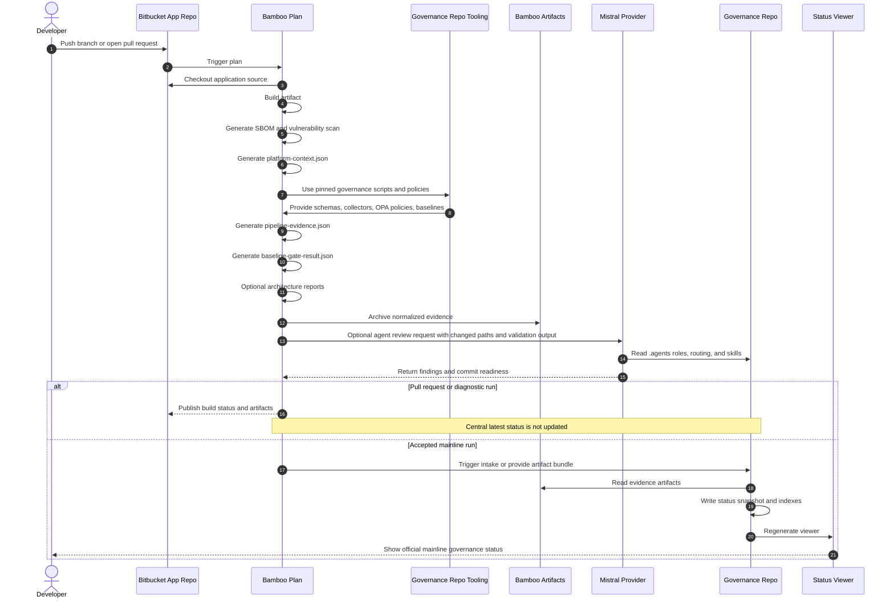

# Company Target Path: Bitbucket, Bamboo, And Mistral

## Purpose

This document describes how the current GitHub and Codex prototype maps to a company setup based on Bitbucket, Bamboo, and Mistral.

The goal is not to create a second governance system for the company toolchain.

The goal is to keep the same governance core and replace only provider and platform adapters.

## Target Picture

```text
Application repository in Bitbucket
        |
        v
Bamboo plan or Bitbucket pipeline
        |
        v
Normalized evidence artifacts
        |
        v
Governance repository
  shared schemas, scripts, OPA policies, baselines
        |
        v
Central intake and status snapshots
        |
        v
Status viewer, reports, and audit trail

Mistral provider adapter
        |
        v
Governance agent review using the same .agents contracts
```

## What Stays The Same

These parts should remain the shared governance core:

```text
.agents/roles/
.agents/routing/governance-agent-routing.yaml
.agents/skills/
schemas/
policies/opa/
scripts/
model/
architecture/
releases/
docs/operations/
```

The same concepts must stay stable:

- role ownership
- routing from changed paths to governance roles
- evidence contracts
- baseline levels
- OPA policies
- report-only versus blocking classification
- release impact classification
- central status snapshot shape
- viewer latest-result rule

## What Changes

| Prototype path | Company target path | Notes |
|---|---|---|
| GitHub repository | Bitbucket repository | Application source lives in Bitbucket. |
| GitHub Actions workflow | Bamboo plan or Bitbucket Pipelines | Platform syntax changes only. |
| GitHub reusable workflow | Shared scripts, Bamboo Specs, or controlled template | Governance logic still comes from this repo. |
| GitHub artifacts | Bamboo artifacts or Bitbucket artifacts | Artifact names and download APIs change. |
| GitHub Branch Protection API | Bitbucket Branch Permissions and Merge Checks API | Normalize into the same platform context fields. |
| GitHub PR metadata | Bitbucket PR metadata | Normalize event, source branch, target branch, and PR id. |
| GitHub repository_dispatch intake | Bamboo or Bitbucket-triggered intake | Use artifact bundle or platform API adapter. |
| Codex provider | Mistral provider | Provider reads the same `.agents` contracts. |

## Provider Adapter: Mistral

Mistral should be a provider adapter only.

Use:

```text
.agents/providers/mistral/README.md
.agents/providers/mistral/governance-agent-dispatch.prompt.md
.agents/providers/mistral/role-execution-contract.md
```

Mistral must read:

```text
.agents/routing/governance-agent-routing.yaml
.agents/roles/*.yaml
.agents/skills/*/SKILL.md
docs/governance/governance-roles-and-agent-profiles.md
```

Mistral must not define:

- its own governance roles
- its own routing rules
- its own validation matrix
- Mistral-only governance invariants
- Bamboo or Bitbucket pipeline syntax

## Platform Adapter: Bitbucket And Bamboo

Bitbucket and Bamboo should be platform adapters only.

Use current starting points:

```text
pipeline-baseline/templates/bitbucket/README.md
pipeline-baseline/templates/bitbucket/bitbucket-pipelines.yml
pipeline-baseline/templates/bamboo/README.md
pipeline-baseline/templates/bamboo/bamboo-specs/bamboo.yaml
pipeline-baseline/templates/bamboo/bamboo-specs/architecture-governance.yaml
```

They should produce normalized evidence:

```text
generated/evidence/platform-context.json
generated/evidence/pipeline-evidence.json
generated/evidence/baseline-gate-result.json
generated/control-evaluation-report.json
generated/app/architecture-release-input.json
generated/app/architecture-governance-report.json
generated/app/architecture-governance-report.md
```

They should archive those files as platform artifacts.

`generated/app/architecture-release-input.json` may include:

```text
architecture.detailed_evidence
```

This is a report-only section for neutral detailed architecture evidence such as `threat_model`, `interface_contract`, `deployment_manifest`, and `model_based_architecture`.

Bamboo and Bitbucket do not need special logic for these types. They should archive the same normalized JSON artifact. The governance repository owns interpretation, schemas, reports, and future promotion from report-only to blocking.

For application-team adoption steps, see:

```text
docs/operations/evidence/detailed-architecture-evidence-adoption-guide.md
```

They should not fork:

- control definitions
- architecture gate definitions
- OPA policies
- JSON schemas
- central status shape
- agent roles

## Complete Company Timing



## Required Data Mapping

| Normalized field | Bitbucket or Bamboo source |
|---|---|
| `repository_id` | Bitbucket workspace/project and repository slug |
| `branch` | Bamboo linked repository branch or Bitbucket branch |
| `target_branch` | Bitbucket pull request destination branch |
| `commit_id` | Bamboo linked repository revision or Bitbucket commit |
| `pipeline_id` | Bamboo plan key or Bitbucket pipeline UUID |
| `pipeline_run_id` | Bamboo build result key or Bitbucket build number |
| `pipeline_url` | Bamboo result URL or Bitbucket pipeline URL |
| `event` | pull request, branch build, mainline push, manual, scheduled |
| `status` | Bamboo build state or Bitbucket pipeline result |
| `branch_protected` | Bitbucket Branch Permissions lookup |
| `review_required` | Bitbucket Merge Checks or project policy |
| `direct_push_allowed` | Bitbucket Branch Permissions lookup |

## Minimum First Company Prototype

Start small and non-blocking. For Bamboo Data Center 12.1.9, use repository-stored Bamboo YAML Specs and copy the template to the application repository as:

```text
bamboo-specs/bamboo.yaml
```

1. Pick one application repository in Bitbucket.
2. Add or adapt a Bamboo plan using `pipeline-baseline/templates/bamboo/bamboo-specs/bamboo.yaml`.
3. Generate an application artifact, SBOM, and vulnerability scan.
4. Generate `generated/evidence/platform-context.json`.
5. Generate `generated/evidence/pipeline-evidence.json`.
6. Generate `generated/evidence/baseline-gate-result.json`.
7. Archive evidence as Bamboo artifacts.
8. Keep enforcement in `report-only`.
9. Download the artifact bundle manually.
10. Validate and intake it with:

```bash
python3 scripts/validate_ci_artifact_bundle.py \
  --type devsecops \
  --bundle path/to/bamboo-artifacts

python3 scripts/intake_ci_artifact_bundle.py \
  --type devsecops \
  --bundle path/to/bamboo-artifacts \
  --repository-id PROJECT/repository \
  --governance-baseline-ref l1-baseline-v1.1.3
```

Only after this works should the team automate the intake trigger.

## Mistral First Prototype

Start Mistral separately from Bamboo enforcement.

1. Use changed paths from a branch or pull request.
2. Run deterministic dispatch:

```bash
python3 scripts/dispatch_governance_agents.py <changed-paths>
```

3. Send selected agents, changed paths, user goal, and validation output to Mistral.
4. If available, include `architecture-release-input.json` and `architecture-governance-report.json`.
5. Ask Mistral to treat `architecture.detailed_evidence` as report-only context unless the active governance baseline says otherwise.
6. Use:

```text
.agents/providers/mistral/governance-agent-dispatch.prompt.md
.agents/providers/mistral/role-execution-contract.md
```

7. Require the Mistral output format:

```text
Selected agents
Impact
Required validation
Findings
Commit readiness
```

6. Keep Mistral findings advisory until the team trusts quality and repeatability.

## Signing And Trust

Signing should be introduced as an evidence capability, not as an early blocker.

Recommended sequence:

1. First prove artifact creation, evidence generation, and central intake.
2. Add artifact checksums and verify they survive archive and intake.
3. Add signature evidence for application artifacts.
4. Add identity evidence for Bamboo plan execution.
5. Add branch permission and merge-check evidence from Bitbucket.
6. Only then consider blocking behavior for missing signatures.

Potential signing evidence paths:

```text
dist/application-source.tar.gz
dist/application-source.tar.gz.sig
security/sbom.cyclonedx.json
security/sbom.cyclonedx.json.sig
generated/evidence/pipeline-evidence.json
generated/evidence/pipeline-evidence.json.sig
```

The governance model should record:

- signature exists
- signature algorithm
- signer identity
- verification status
- timestamp
- key or certificate reference

## Tokens And Access

The company setup needs clear token boundaries.

| Need | Suggested owner | Notes |
|---|---|---|
| Bitbucket repository checkout | Bamboo linked repository credential | Should be least privilege. |
| Bitbucket PR and branch permissions lookup | Platform automation token | Read-only API access is preferred. |
| Bamboo artifact download | Governance intake automation | Must access only required plan artifacts. |
| Governance repo write access | Governance automation identity | Should commit only status snapshots, indexes, and viewer output. |
| Mistral API access | AI platform team or controlled service account | Provider usage should be logged. |

Avoid using one broad personal token for all steps.

## Current Repository Readiness

Already available:

- model-neutral agent contracts under `.agents/`
- Mistral provider adapter under `.agents/providers/mistral/`
- Bitbucket template under `pipeline-baseline/templates/bitbucket/`
- Bamboo templates under `pipeline-baseline/templates/bamboo/`
- normalized platform context generator
- normalized pipeline evidence generator
- CI artifact bundle validation and intake scripts
- agent review operator runbook
- application-to-governance timing diagram

Still needed before a real company rollout:

- real Bamboo variable verification in the company environment
- Bitbucket Branch Permissions API lookup
- Bitbucket Merge Checks lookup
- Bamboo artifact download automation
- automated Bamboo-to-governance intake trigger
- company-approved Mistral wrapper or API gateway
- signature evidence schema extension if signatures become required
- agreed report-only to blocking transition criteria

## Decision Points For The Company Team

| Topic | Decision needed |
|---|---|
| Governance repo hosting | Is the central governance repo in Bitbucket, GitHub Enterprise, or another internal Git service? |
| Baseline consumption | Do application repos clone the governance repo, use a packaged artifact, or call shared scripts from a pinned ref? |
| Bamboo Specs | Are Bamboo Specs YAML supported, or must plans be configured through the UI? |
| Artifact retention | How long are Bamboo artifacts retained, and can governance intake access historical runs? |
| Branch controls | Which Bitbucket APIs expose branch permissions and merge checks in the company instance? |
| Mistral access | Is Mistral called directly, through an internal gateway, or through a managed AI platform? |
| Signing | Which signing tool, key store, and verification policy are company-approved? |
| Blocking gates | Which findings can block immediately, and which remain report-only during adoption? |

## Recommended Next Steps

1. Keep GitHub/Codex as the learning and prototype path.
2. Use Bitbucket/Bamboo templates only as adapters, not as forks.
3. Build one Bamboo report-only prototype with a disposable application repository.
4. Validate the artifact bundle locally in the governance repo.
5. Intake the bundle into central status.
6. Add Mistral advisory review for the same change.
7. Review the result with platform, security, and governance stakeholders.
8. Decide which parts can become automated and which must remain manual approval steps.

## Related Documentation

```text
docs/operations/processes/application-repo-governance-timing.md
docs/operations/adapters/cicd-platform-adapter-strategy.md
docs/operations/agents/how-to-run-agent-review.md
docs/operations/agents/agent-system-usage.md
.agents/providers/mistral/README.md
pipeline-baseline/templates/bitbucket/README.md
pipeline-baseline/templates/bamboo/README.md
pipeline-baseline/templates/bamboo/bamboo-specs/bamboo.yaml
pipeline-baseline/templates/bamboo/bamboo-specs/architecture-governance.yaml
docs/operations/adapters/bitbucket-bamboo-governance-adapter.md
```
