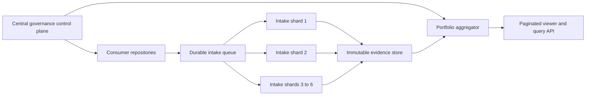

# Consumer Scale Capacity Assessment

## Purpose And Decision

This assessment examines whether the current Governance-as-Code repository can
operate with 300 to 1,500 consumer repositories. It separates the scalability
of distributed policy evaluation from central result intake, storage,
publication and viewer delivery.

The current implementation has no fixed consumer-count limit in its schemas or
index data structures. The isolated generators process 1,500 current-shaped
consumers in seconds. The current **one intake workflow and one review PR per
result** is not an acceptable production operating model at that scale.
Unbounded Git history and an eager static viewer also become material limits.

The recommended target keeps one logical governance control plane and scales
the evidence plane independently through asynchronous intake, immutable
external evidence storage, batched read-model publication and three to six
intake shards for 1,500 consumers. Fully independent governance instances are
reserved for regulatory, residency or organisational isolation.

This document records a capacity assessment and target direction. It does not
declare the current repository production-ready for 300 or 1,500 consumers,
change a baseline or enable blocking enforcement.

## Artifact Classification

| Field | Decision |
|---|---|
| Artifact | Consumer scale simulation and capacity assessment |
| Type | Planning documentation, diagnostic tool and tests |
| Target | `docs/operations/planning/`, `scripts/`, `tests/` and documentation navigation |
| Owner | Governance Platform Lead |
| Source Document Intake required | no; this is an engineering assessment of the implemented system |
| Evidence contract impact | none |
| Runtime governance impact | none; the simulation is isolated and report-only |
| Release impact | none |

## Current Processing Model

Consumer repositories execute released governance workflows in their own CI
context. This distributed evaluation model prevents the central repository
from running all consumer tests itself. Completed consumer runs dispatch one or
more central intake workflows.

Each current central intake performs a fresh checkout and tool setup, retrieves
and verifies evidence, regenerates global indexes and viewer projections, runs
repository validation, creates an automation branch and opens an operational
review PR. Concurrency keys isolate repository and downstream run identity, but
different consumers can still update the same global index and viewer files.
Concurrent proposals therefore require reconciliation and regeneration.

The accepted evidence stores and telemetry are append-only. This protects
history and prevents silent replacement, but every result remains in Git and
the current indexes retain complete history arrays.

## Reproducible Isolated Simulation

Run the diagnostic from the repository root after bootstrapping the validation
environment:

```bash
./scripts/bootstrap_validation_env.sh
.venv-validation/bin/python scripts/simulate_consumer_scale.py \
  --repositories 300 1500 \
  --output /tmp/governance-consumer-scale.json
```

The simulation uses the latest accepted ha-CPsWMS result shapes. Per synthetic
consumer it creates one DevSecOps result, one architecture result and the two
latest typed-evidence result types. All input files and generated indexes are
placed in a temporary directory. Official `status/`, `generated/` and viewer
files are read but never modified.

The detailed viewer scenario materializes 300 copies of the current
ha-CPsWMS-shaped repository row. Larger detailed scenarios use a lower-bound
size estimate to avoid allocating several hundred megabytes merely to run the
diagnostic.

### Measurement Scope

Included:

- actual DevSecOps, architecture and typed-evidence index generators;
- portfolio read-model construction;
- current static viewer JSON serialization;
- output size, elapsed process time and peak Python allocation.

Excluded:

- GitHub API and artifact download latency;
- Actions queueing, runner provisioning and plan-specific concurrency;
- branch, PR, review and merge throughput;
- browser parse, render and interaction latency;
- multiple historical runs per consumer and long-term Git growth.

The excluded areas need a separate controlled GitHub load exercise before
production admission.

## Measurement On 19 September 2026

The recorded diagnostic ran with Python 3.14.4 on macOS. Values are engineering
measurements from one workstation, not service-level guarantees. Re-run the
tool on the intended runner class before sizing production infrastructure.

### Index And Portfolio Processing

| Projection | 300 consumers | 1,500 consumers |
|---|---:|---:|
| DevSecOps index | 0.32 s, 2.4 MiB peak, 0.66 MB | 1.77 s, 11.3 MiB peak, 3.28 MB |
| Architecture index | 0.32 s, 2.4 MiB peak, 0.66 MB | 1.83 s, 11.4 MiB peak, 3.32 MB |
| Typed-evidence index | 1.16 s, 20.7 MiB peak, 7.78 MB | 7.20 s, 102.5 MiB peak, 38.89 MB |
| Portfolio projection | 0.02 s, 0.24 MB | 0.09 s, 1.19 MB |

These measurements show approximately linear processing for a single current
result set. They do not cover history growth. Because every generator currently
reads all matching JSON files and writes history into global indexes, daily
results for 1,500 consumers would eventually dominate both generation time and
index size.

### Viewer Payload

| Viewer scenario | 300 consumers | 1,500 consumers |
|---|---:|---:|
| Light repository rows | 1.11 MB; 0.11 s | 3.94 MB; 0.47 s |
| Current ha-CPsWMS-shaped details | 88.69 MB; 8.35 s; 314.1 MiB peak | at least 393.78 MB pretty JSON / 266.70 MB compact JSON |

The detailed source row contains 153 grouped high or critical findings plus L1,
assurance, staging and history data. The current application downloads the
complete data model before rendering. A portfolio containing many similarly
detailed repositories would therefore be unsuitable for an eager static
single-payload viewer even when transfer compression is enabled.

## Observed Central Workflow Cost

The accepted 19 September reference intakes had these wall-clock durations:

| Intake | Central run | Duration |
|---|---:|---:|
| DevSecOps governance | `35429033183` | about 2:00 |
| Architecture governance | `35428994927` | about 3:25 |
| Typed evidence | `35429124439` | about 3:51 |

If every consumer produces all three result types once per day, the current
model implies the following upper-bound workload before retries or diagnostic
runs:

| Consumers | Central runs per day | Potential operational PRs per day | Aggregate runner time per day |
|---:|---:|---:|---:|
| 300 | 900 | 900 | about 46 hours |
| 1,500 | 4,500 | 4,500 | about 232 hours |

Concurrency can reduce wall-clock delay, but it does not remove overlapping
global files, review demand, content-creation rate, API pressure or cost.
Actual demand follows this formula:

```text
daily intake operations = consumers × evaluated commits per day × enabled intake types
```

## Capacity Findings

| Area | Current characteristic | Assessment at 1,500 |
|---|---|---|
| Policy and baseline distribution | Consumer-side reusable workflows | Scalable when consumer CI and release distribution are sized independently |
| Central intake | One complete workflow per result | Primary throughput and cost bottleneck |
| Publication | One branch and PR per changed intake | Operationally unsuitable without batching or a separate trusted writer path |
| Result storage | Append-only JSON and global indexes in Git | Audit-friendly pilot model; unbounded production history is not sustainable |
| Index generation | Linear full-directory scan and full history projection | Fast for first result set; degrades with accumulated history |
| Viewer | One eager static data payload | Must be split into summary and lazy, paginated detail models |
| Authentication | Shared cross-repository intake credential | Replace with a least-privilege GitHub App for production scale |
| Recovery | Collection attempts and explicit retry | Preserve, then add queue backpressure and dead-letter handling |
| Observability | Intake events and 30-day health projection | Extend with queue depth, shard lag, throughput and SLO alerts |

GitHub documents plan-dependent Actions concurrency and a workflow-trigger
limit of 1,500 events per ten seconds per repository. Its REST API also applies
primary and secondary rate limits, including a maximum of 100 concurrent API
requests and content-creation controls. GitHub recommends keeping repository
push rate at or below six per minute, Git read operations near fifteen per
second and directory width below 3,000 entries. These are platform constraints,
not capacity guarantees:

- [GitHub Actions limits](https://docs.github.com/en/enterprise-cloud@latest/actions/reference/limits)
- [REST API rate limits](https://docs.github.com/en/rest/using-the-rest-api/rate-limits-for-the-rest-api)
- [Repository limits](https://docs.github.com/en/repositories/creating-and-managing-repositories/repository-limits)

## Recommended Target Architecture



### Central Control Plane

Keep one logical authority for sources, controls, policies, schemas, baseline
releases and reusable workflow versions. This avoids baseline drift and keeps a
single release identity across the portfolio.

### Asynchronous Evidence Plane

Place a durable queue between producer dispatch and verification. Intake
workers validate schema, repository/run binding, hashes, freshness, replay and
idempotency before storing evidence. Queue depth supplies backpressure; failed
messages move to a dead-letter path without blocking unrelated consumers.

### Evidence Storage

Store complete immutable evidence and history in an object store with retention
and, where required, object lock. Git retains policies, schemas, release
packages, current summary manifests, content hashes and reviewed governance
decisions. A stored evidence reference must include repository, commit, run,
attempt, evidence type, content digest and storage identity.

### Batched Read Models

Regenerate portfolio, freshness, intake-health and viewer summaries on a fixed
interval or after a bounded batch. One batch publication represents many
verified events. Policy changes continue to require the full validation and
review route; routine evidence admission receives a narrower append-only
validation appropriate to its contract.

### Viewer Delivery

Publish a small portfolio summary and separate repository detail documents.
Load findings, histories and raw evidence references only when requested.
Repository lists and findings need server-side or precomputed pagination. A
static Pages deployment remains possible with partitioned JSON; a query service
becomes useful for cross-portfolio search and long histories.

### Authentication

Use a GitHub App with installation tokens and repository-scoped permissions.
Installation identity, token expiry, rate-limit headers and request correlation
belong in operational telemetry. A personal or broadly shared token is not an
appropriate production identity for 1,500 consumers.

## Sharding Strategy

For 1,500 consumers, start capacity planning with three to six evidence shards
of roughly 250 to 500 repositories. Use a stable shard key such as organisation
and regulatory domain, or a consistent hash when consumers are homogeneous.

Each shard owns its queue partition, worker capacity, evidence namespace and
detail read model. The central aggregator reads signed or digest-bound shard
summaries and exposes one portfolio view. Moving a consumer between shards must
preserve the evidence identity and retained history.

Separate full governance instances are appropriate when one of these boundaries
exists:

- legally required tenant or data-residency isolation;
- independent policy authority and release ownership;
- restricted network or credential boundary;
- availability domain requiring independent operation.

Every full instance must consume the same centrally released baseline or record
an explicit fork and compatibility decision. A federation catalog records
instance identity, baseline versions, consumer allocation and summary
freshness.

## Delivery Stages

### Stage 1: Repeatable Capacity Baseline

- retain this versioned simulation for 300, 750 and 1,500 consumers;
- add CI thresholds for generator time, memory and output size;
- run controlled GitHub burst tests in a non-production repository;
- define expected consumer cadence and evidence types.

### Stage 2: Batch The Existing Git Path

- decouple producer dispatch from global regeneration;
- accept idempotent events into a queue or bounded staging ledger;
- publish one reviewed batch instead of one PR per result;
- validate evidence contracts during admission and run full validation once per batch.

This stage can support an initial 300-consumer operating pilot when its measured
SLOs pass.

### Stage 3: Separate Evidence Storage And Viewer Data

- move full immutable evidence history out of Git;
- keep hash-bound manifests and current summaries under governance control;
- partition viewer data by repository and evidence type;
- add retention, backup and restore tests.

### Stage 4: Shard And Federate

- introduce three to six intake shards;
- operate one central portfolio aggregator;
- rehearse shard loss, replay, backlog drain and consumer reassignment;
- add capacity and freshness alerts per shard.

## Production Admission Criteria

The platform should not claim support for 300 or 1,500 consumers until the
corresponding test profile demonstrates all of the following:

- no lost, overwritten or cross-consumer evidence;
- idempotent replay under duplicate and reordered delivery;
- p95 accepted-result latency within an approved target;
- bounded queue backlog with demonstrated drain and dead-letter recovery;
- viewer portfolio payload below 3 MB and repository details loaded separately;
- restore of evidence, manifests and current read models from backup;
- stable baseline identity across every shard or instance;
- documented rate-limit budget and GitHub App credential recovery;
- sustained target cadence plus an approved burst factor;
- failure of one shard does not corrupt another shard or the central baseline.

Initial engineering targets may use p95 intake publication under 15 minutes and
backlog drain under 60 minutes, but these values require accountable operational
approval before they become SLOs.

## Current Conclusion

The current repository remains suitable as a controlled low-volume pilot and
as the central control-plane source. Its core projections show sufficient
short-term CPU performance for 1,500 first-result consumers. Production scale
requires the intake, storage, publication and viewer changes above. Multiple
complete governance repositories are not the first scaling mechanism; shard
the evidence plane while retaining one governed baseline authority.
