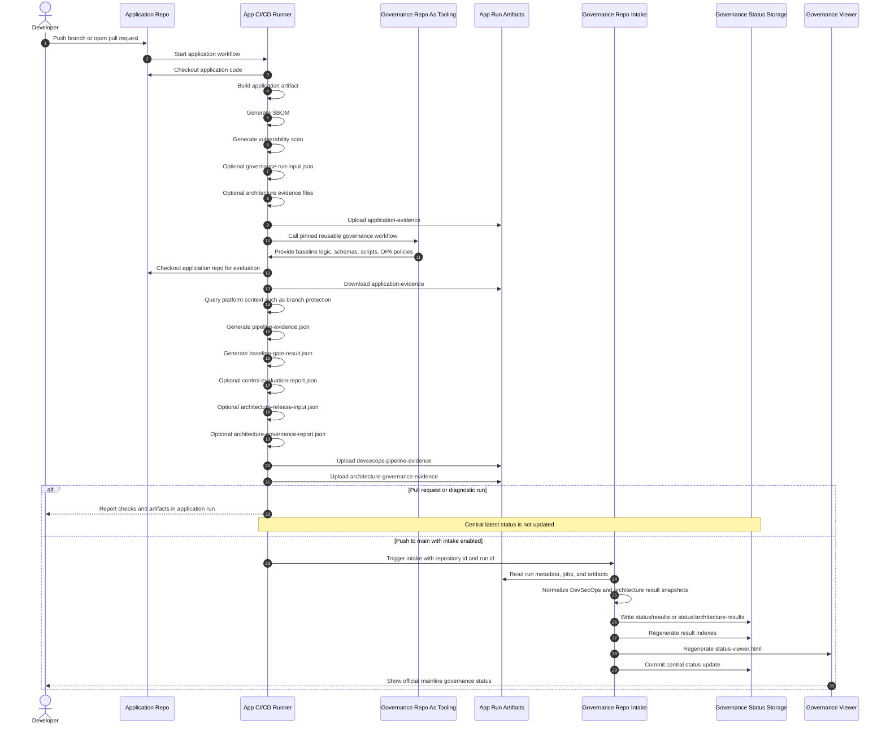

# Application Repo To Governance Repo Timing

## Purpose

This document shows the complete timing of a governance run across an application repository and the central governance repository.

It answers:

- when the application repository works
- which data it produces
- when the governance repository is used as tooling
- when results are only application-run artifacts
- when results become central governance status
- why pull requests and mainline pushes are treated differently

## Core Rule

The application repository owns evidence production.

The governance repository owns governance interpretation, baselines, policies, reusable workflows, intake, indexes, and the viewer.

Pull requests validate a proposed change and publish artifacts in the application repository run.

Only an accepted mainline signal, normally a `push` to `main`, should update the central governance repository status indexes and viewer.

## Complete Timing Diagram



## Timing Table

| Time | Location | Actor | Data in motion | Result |
|---:|---|---|---|---|
| T0 | Application repo | Developer | code, config, evidence files | Branch, PR, or main push exists |
| T1 | Application CI/CD | App workflow | repository metadata, commit, branch, event | Run context exists |
| T2 | Application CI/CD | App workflow | source archive or build artifact | `dist/application-source.tar.gz` or equivalent |
| T3 | Application CI/CD | App workflow | SBOM | `security/sbom.cyclonedx.json` |
| T4 | Application CI/CD | App workflow | vulnerability scan | `security/vulnerability-scan.json` |
| T5 | Application CI/CD | App workflow | optional governance facts | `governance/governance-run-input.json` |
| T6 | Application CI/CD | App workflow | optional architecture evidence | `.governance/architecture/*.json` |
| T7 | Application artifacts | CI/CD platform | raw application evidence | Artifact such as `application-evidence` |
| T8 | Application CI/CD | Reusable governance workflow | pinned governance baseline ref | Governance repo is used as tooling |
| T9 | Application CI/CD | Governance tooling | platform context and evidence | `pipeline-evidence.json` |
| T10 | Application CI/CD | Governance tooling | baseline evaluation | `baseline-gate-result.json` |
| T11 | Application CI/CD | Governance tooling | optional control report | `control-evaluation-report.json` |
| T12 | Application CI/CD | Governance tooling | optional architecture collector output | `architecture-release-input.json` |
| T13 | Application CI/CD | Governance tooling | optional architecture gate output | `architecture-governance-report.json` |
| T14 | Application artifacts | CI/CD platform | evaluated governance evidence | `devsecops-pipeline-evidence`, `architecture-governance-evidence` |
| T15a | Application repo only | PR or manual run | checks and artifacts | No central latest status update |
| T15b | Governance repo intake | Mainline run | repository id, run id, baseline refs | Intake starts |
| T16 | Governance repo intake | Intake scripts | app run metadata, jobs, artifacts | Normalized result snapshot |
| T17 | Governance repo | Intake scripts | central status snapshot | `status/results/...json` or `status/architecture-results/...json` |
| T18 | Governance repo | Generators | result snapshots | central indexes |
| T19 | Governance repo | Generator | indexes and static assets | `generated/viewer/status-viewer.html` |
| T20 | Governance repo | Automation | status files and viewer | Commit to governance repo |

## DevSecOps Data Path

Application repository input:

```text
dist/application-source.tar.gz
security/sbom.cyclonedx.json
security/vulnerability-scan.json
governance/governance-run-input.json
```

Application run output:

```text
generated/evidence/pipeline-evidence.json
generated/evidence/baseline-gate-result.json
generated/control-evaluation-report.json
```

Application artifact names:

```text
application-evidence
devsecops-pipeline-evidence
devsecops-governance-run-input
```

Governance repository central intake output:

```text
status/results/<owner>__<repo>/<timestamp>-run-<run-id>.json
status/repository-results-index.json
generated/viewer/status-viewer.html
```

## Architecture Data Path

Application repository input:

```text
.governance/architecture/*.json
docs/ARCHITECTURE.md
docs/DEPLOYMENT.md
docker-compose.yml
tests/
schemas/
```

Application run output:

```text
generated/app/architecture-release-input.json
generated/app/architecture-governance-report.json
generated/app/architecture-governance-report.md
```

Application artifact name:

```text
architecture-governance-evidence
```

Governance repository central intake output:

```text
status/architecture-results/<owner>__<repo>/<timestamp>-run-<run-id>.json
status/architecture-results-index.json
generated/viewer/status-viewer.html
```

## Pull Request Versus Mainline Timing

| Application event | Governance checks run in app repo | Artifacts created in app run | Governance repo used as tooling | Central intake | Viewer latest updated |
|---|---:|---:|---:|---:|---:|
| Pull request | yes | yes | yes | no by default | no |
| Manual workflow dispatch | yes | yes | yes | no by default | no |
| Push to `main` | yes | yes | yes | yes, when configured | yes |

The separation is intentional.

Pull-request evidence is useful for review, but it must not replace the official mainline status. The viewer latest result should represent accepted mainline state.

## GitHub Reference Path

In GitHub, the connection is usually:

1. Application workflow produces evidence.
2. Application workflow calls a pinned reusable workflow from the governance repo.
3. Application workflow uploads evidence artifacts.
4. On `push` to `main`, application workflow triggers `repository_dispatch` into the governance repo.
5. Governance intake workflow reads the application run by `run_id`.
6. Governance repo writes central status snapshots, indexes, and viewer output.

Relevant governance repo workflows and scripts:

```text
.github/workflows/devsecops-baseline-reusable.yml
.github/workflows/intake-governance-result.yml
.github/workflows/intake-architecture-result.yml
scripts/intake_github_actions_run.py
scripts/intake_architecture_github_actions_run.py
scripts/generate_repository_results_index.py
scripts/generate_status_viewer.py
```

## Bitbucket And Bamboo Target Path

In a Bitbucket and Bamboo setup, the timing should stay the same even though the platform implementation changes.

For the concrete company target path that combines Bitbucket, Bamboo, and Mistral, see:

```text
docs/operations/adapters/company-bitbucket-bamboo-mistral-target-path.md
```

The application repository should still produce normalized evidence:

```text
generated/evidence/platform-context.json
generated/evidence/pipeline-evidence.json
generated/evidence/baseline-gate-result.json
```

Bamboo or Bitbucket should archive evidence artifacts.

The governance repository should intake an artifact bundle or platform run through adapter-specific intake code, while preserving the same central status shape:

```text
status/results/
status/architecture-results/
status/repository-results-index.json
status/architecture-results-index.json
generated/viewer/status-viewer.html
```

The platform changes. The governance contract should not.

## Ownership Boundaries

| Area | Owner | Notes |
|---|---|---|
| Application code | Application team | The governance repo should not own application implementation. |
| Build artifact | Application team | Must be reproducible and referenced by evidence. |
| SBOM and scan | Application team plus Security | Must be generated by approved tools in production. |
| Governance baseline logic | Governance maintainers | Versioned in the governance repo. |
| Reusable workflows | Governance maintainers | Application repos consume by pinned ref. |
| Platform CI/CD syntax | Platform or DevSecOps team | GitHub, Bitbucket, Bamboo, Jenkins, and GitLab are adapters. |
| Central intake | Governance automation | Converts app run artifacts into central status. |
| Viewer latest status | Governance repo | Should represent mainline status, not temporary PR state. |

## What To Inspect During A Full Run

In the application repository:

```text
workflow run event
branch
commit id
artifact list
application-evidence
devsecops-pipeline-evidence
architecture-governance-evidence
```

In the governance repository:

```text
intake workflow run
status/results/
status/architecture-results/
status/repository-results-index.json
status/architecture-results-index.json
generated/viewer/status-viewer.html
```

## Related Detailed Guides

Use these guides for the step-by-step details behind the timing diagram:

```text
docs/operations/evidence/application-repo-evidence-flow.md
docs/operations/evidence/application-repo-architecture-evidence-flow.md
docs/operations/evidence/governance-result-intake-and-viewer-usage.md
docs/operations/adapters/cicd-platform-adapter-strategy.md
```
