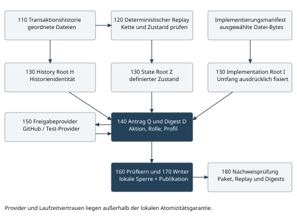
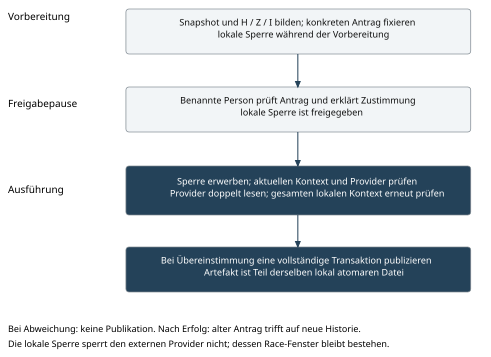

# 3 Design und Architektur

## 3.1 Ausführungsform und Systemgrenze

Die implementierte Ausführungsform verarbeitet einen synthetischen Consumer und einen Befund auf einem lokalen POSIX-Dateisystem. Alle beteiligten lokalen Schreiber müssen dieselbe Sperre beachten. Die einzig zugelassene Publikationsaktion heißt `publish_test_artifact`; sie nimmt eine Zeichenkette von höchstens 4.096 UTF-8-Bytes entgegen. Das Artefakt wird als Inhalt einer unveränderlich behandelten JSON-Transaktion sichtbar. Es wird kein Deployment und kein beliebiger Shell-Befehl ausgeführt.

Das System besteht aus einem lokalen Kern, einem optionalen Adapter für die persönliche GitHub-Erklärung und einem getrennten Nachweispfad. Abbildung 1 zeigt die Komponenten und ihre Datenbeziehungen. Bezugszeichen 110 bis 180 bezeichnen die implementierten Komponenten. Das Diagramm ist eine technische Erläuterung und keine Behauptung einer verteilten atomaren Transaktion.



| Zeichen | Komponente | Implementierte Verantwortung |
|---|---|---|
| 110 | Transaktionsspeicher | Geordnete Dateien, Inhaltsidentität, exklusive lokale Sperre |
| 120 | Replay und Projektion | Kette prüfen und definierten Zustand ableiten |
| 130 | Commitment-Berechnung | H, Z und I aus expliziten Datenstrukturen bilden |
| 140 | Antragsersteller | Aktionsinhalt und Kontextwerte unveränderlich zusammenstellen |
| 150 | Freigabeprovider | Test-Provider oder persönliche Erklärung über GitHub |
| 160 | Prüf- und Ausführungskern | Aktuellen Kontext, Erklärung und Antrag unter Sperre prüfen |
| 170 | Atomarer Writer | Testinhalt und Nachweise als eine neue Transaktion veröffentlichen |
| 180 | Nachweisprüfung | Aufbewahrte Daten und deklarierte Ergebnisse erneut prüfen |

## 3.2 Persistente Daten und Zustand

Ein Workspace enthält `EXPERIMENT.json`, `executor-config.json`, `provider.json` und `ledger/transactions/`. Der persönliche Demonstrationslauf ergänzt `personal-request.json` und die Erklärungsvorlage. Die lokale Sperrdatei gehört nicht zur fachlichen Historie. Ein freigegebener Prototypbereich im Repository ist von offiziellen Statusindizes, Website-Ausgaben und Releases getrennt.

Die Historie enthält Transaktionen mit exakt diesen Feldern: `version`, `scope`, `sequence`, `previous_ref`, `event`, `transaction_id`. `previous_ref` enthält ID und Digest der vorangegangenen vollständigen Transaktion. Die neue Transaktions-ID wird aus dem kanonischen Inhalt ohne das Feld `transaction_id` berechnet. Der Dateiname bindet Sequenz und Inhaltsidentität. Replay prüft jede Transaktion und jede Zustandsänderung; ein behaupteter Head allein genügt nicht.

Der Ausgangszustand besteht aus sechs Feldern:

| Zustandsfeld | Inhalt und Bedeutung |
|---|---|
| `revision` | Semantische Revision; Auditnotizen erhöhen sie nicht |
| `latest_evidence` | Letzter akzeptierter synthetischer Prüflauf mit `run` und `result` |
| `publication` | Aktuell wirksamer Antragsdigest und Artefakt oder `null` |
| `role_binding` | Synthetisches Subjekt und Aktivstatus |
| `profile` | Kennung und Version des Versuchsprofils |
| `revoked_requests` | Sortierte Liste ausdrücklich widerrufener Antragsdigests |

Die Zustandsprojektion ist absichtlich klein. Sie enthält keine vollständige Governance-Baseline und keine beliebige Unternehmensberechtigung. Ihre Revision gehört ausdrücklich zur Semantik. Zwei Ereignisfolgen, die dieselben fachlichen Statuswerte, aber unterschiedliche semantische Revisionen ergeben, müssen deshalb nicht denselben Z-Wert haben. Nachgewiesen ist die Gleichheit von Z bei einer reinen Auditnotiz.

## 3.3 Kanonisierung und Trennung der Hashdomänen

Alle neuen Commitments nutzen SHA-256 über die vorhandene kanonische JSON-Darstellung des Repositorys. Objektschlüssel werden sortiert; Zeichen werden als ASCII-Escapes ausgegeben; Komma und Doppelpunkt sind die Trennzeichen ohne zusätzliche Leerzeichen; die resultierende Zeichenfolge wird als UTF-8 ohne abschließenden Zeilenumbruch gehasht.

Zugelassen sind `null`, boolesche Werte, ganze Zahlen, Zeichenketten, Listen und Objekte mit Zeichenkettenschlüsseln. Gleitkommazahlen, NaN, doppelte JSON-Schlüssel und nicht unterstützte Typen werden zurückgewiesen. Listenreihenfolge bleibt erhalten; die Menge der widerrufenen Anträge wird vor der Darstellung sortiert. Unicode wird nicht zusätzlich normalisiert. Ein boolescher Wert und eine ganze Zahl sind unterschiedliche Werte.

Die kanonische Darstellung ist ein eigener eingeschränkter Repositoryvertrag. Sie wird nicht als Implementierung von RFC 8785 ausgegeben. RFC 8785 ist eine verwandte Referenz für standardisierte JSON-Kanonisierung; eine Übernahme würde eine ausdrücklich versionierte Kompatibilitätsentscheidung erfordern. [E2]

Jeder Root wird über einen typisierten und versionierten Umschlag berechnet. Die folgenden Ausdrücke benennen die genauen Felder; `scope`, `state` und `files` stehen jeweils für die vollständigen Datenobjekte:

```text
HistoryEnvelope = {
  commitment_type: "prototype-history", version: "1", scope,
  transaction_count: Anzahl(L), head_ref: Referenz(letzte Transaktion)
}
StateEnvelope = {
  commitment_type: "prototype-state", version: "1", scope, state
}
ImplementationEnvelope = {
  commitment_type: "prototype-implementation", version: "1", files
}
```

Für die leere Historie ist `head_ref=null` und der Zähler null. Es gibt keinen aktuellen Uhrzeitwert in der Root-Berechnung. Die gesamte validierte Vorgeschichte ist über die rekursiven Vorgängerreferenzen gebunden. Es wird weder eine zweite Historienkette noch ein Merkle-Baum angelegt.

## 3.4 Das Implementierungsmanifest

`source_manifest()` zählt die Python-Dateien unmittelbar unter `experiments/state_binding/`, die importierte Lifecycle-Bibliothek, `result_ledger.py`, die Initialisierungsdatei der Bibliothek sowie die Deklarationen für Validierungsabhängigkeiten und Toolchain auf. `implementation_manifest()` ergänzt die tatsächlichen Bytes von `workspace/executor-config.json`.

Das Manifest bildet jeden relativen Pfad auf den SHA-256-Digest seiner unveränderten Datei-Bytes ab. Hinzugefügte, entfernte oder geänderte Dateien innerhalb dieses festgelegten Umfangs beeinflussen I. Symbolische Links werden zurückgewiesen. Das detaillierte Manifest bleibt zusätzlich zum Root erhalten und ermöglicht eine dateigenaue Diagnose.

Das Manifest umfasst nicht automatisch das Betriebssystem, sämtliche installierten Bibliotheksbytes, dynamisch geladene Maschineninstruktionen oder externe Dienste. Die Bindung an Lock-Dateien dokumentiert Abhängigkeitsdeklarationen; sie attestiert nicht, dass ein kompromittierter Interpreter diese Deklarationen korrekt verwendet. Die Vertrauensgrenze muss bei jeder Übertragung neu festgelegt werden.

## 3.5 Antrag und zwei Ebenen der Demonstrationsfreigabe

Der innere Antrag enthält genau `version`, `scope`, `action`, `roots`, `implementation_manifest`, `subject`, `profile`, `role_binding`, `expected_head` und `expected_sequence`. Der Aktionskörper enthält `kind` und `content`. Die erwartete Sequenz ist die Anzahl der bereits vorhandenen Transaktionen, nicht das Feld `state.revision`.

Der automatische Test-Provider bestätigt den vollständigen Antragsdigest für `test-person:owner`. Seine Erklärung enthält `request_digest`, `subject`, `status`, `environment` und eine Providerrevision. Diese lokale JSON-Struktur ist bewusst ein Test-Double und beweist keine tatsächliche Identität.

Für den persönlichen Lauf gibt es zusätzlich einen äußeren Antrag vom Typ `private-prototype-local-demo`. Er bindet den gesamten inneren Grant, das konkrete private Repository, PR-Nummer, GitHub-Subjekt-ID, Versuchsrolle, Erstellungszeit, Zweck und `official_state=false`. Die reale Person bestätigt den Digest dieses äußeren Antrags. Dadurch wird der tatsächliche lokale Demo-Effekt zusätzlich an ihre Erklärung gebunden; die synthetischen inneren Daten werden dadurch nicht zu realen Prüfbefunden.

Die Versuchsrolle `prototype_reviewer` ist keine produktive Rollenvergabe. Das Verfahren ersetzt insbesondere nicht die separat erforderliche Betriebsabnahme des bestehenden Governance-Piloten.

## 3.6 Vorbereitung und Publikationsprotokoll

Abbildung 2 trennt die drei Zeitabschnitte: konsistente Vorbereitung, persönliche Prüfung ohne gehaltene lokale Sperre und erneute Prüfung mit Publikation unter Sperre.



Der nachfolgende Pseudocode beschreibt den erfolgreichen persönlichen Pfad. Er fasst die tatsächlichen Funktionen zusammen und ist keine zusätzliche ausführbare API:

```text
Sperre des lokalen Ledgers erwerben
C1 := Historie laden, replayen, Manifest lesen, Roots berechnen
Antrag Q gegen C1 prüfen
Gespeicherte innere Erklärung und aktuellen Test-Provider vergleichen
Ausführungskonfiguration prüfen
GitHub-Antrag und Kommentarbestand direkt erfassen
Kommentarbestand ein zweites Mal lesen und Gleichheit prüfen
Identität, Inhalt, Zeitfolge und Status der Erklärung prüfen
C2 := vollständigen lokalen Kontext nochmals lesen und berechnen
C2 muss C1 entsprechen; Test-Provider muss unverändert sein
Neue Transaktion mit Antrag, Manifest, Erfassung und Artefakt validieren
Transaktion exklusiv veröffentlichen und Verzeichnis synchronisieren
Sperre freigeben
```

`preconditions()` vergleicht Rolle, Aktivstatus, Profil, Widerrufsliste, Vorhandensein von Evidenz, die drei Roots, Head und Transaktionsanzahl. Der normale Pfad korrigiert keine Abweichung automatisch. Die Weglassschalter gehören ausschließlich zu gekennzeichneten Experimenten; der persönliche Pfad gestattet keine ausgelassenen Prüfungen.

Die GitHub-Erfassung prüft die erwartete PR-Adresse und liest die Kommentare zweimal. Der Kommentar muss vom benannten Konto des Typs `User` stammen; eine über eine GitHub-App abgegebene Erklärung wird nicht akzeptiert. Die Erklärung enthält einen festen Marker, den vollständigen Antragsdigest, eine Disposition, eine Vorgängerreferenz und einen ausdrücklichen Selbsterklärungstext. Bearbeitete relevante Kommentare, unpassende Zeitfolgen oder ungültige Vorgängerbeziehungen verhindern eine Bestätigung. Im erfassten Nachweis bleiben die originalen Antwortbytes erhalten.

## 3.7 Lokale Atomizität und Fehlerbehandlung

Der Writer legt eine temporäre Datei im Zielverzeichnis an, schreibt ihren vollständigen Inhalt und ruft `fsync` auf. Anschließend wird sie mit einem exklusiven Hardlink unter dem endgültigen Transaktionsnamen sichtbar gemacht. Eine vorhandene Zieldatei wird nicht überschrieben. Danach wird das Verzeichnis synchronisiert und die temporäre Datei entfernt.

Die beobachtbare Aktion ist die Sichtbarkeit der vollständigen Transaktionsdatei einschließlich Artefakt. Dadurch entsteht innerhalb dieser Systemgrenze kein ungeschützter Abstand zwischen einem gespeicherten Freigabebeleg und einem getrennten Artefaktschreibvorgang. Die Aussage gilt unter den dokumentierten lokalen Dateisystemannahmen und für kooperierende Schreiber.

Schlägt eine Vorbedingung fehl, wird keine Publikation angehängt. Der Versuchsrunner bewahrt Ergebnis und Vorher-/Nachher-Dateien außerhalb des Ledgers auf. Ein Prozessabbruch nach Sichtbarkeit der Datei, aber vor einer erfolgreichen Rückmeldung, kann eine unklare Rückmeldung verursachen. Die bereits sichtbare Transaktion bleibt anhand ihres Namens und Inhalts feststellbar. Der alte Antrag erzeugt beim Wiederholungsversuch keinen zweiten Effekt; der Prototyp verspricht keine verteilte Exactly-once-Zustellung oder automatische Wiederholung einer verlorenen Antwort.

## 3.8 Widerruf und aktuelle Wirksamkeit

Im synthetischen Widerrufspfad bestätigt der Test-Provider den Widerruf. `revoke()` hängt eine Korrektur mit dem ursprünglichen Antragsdigest, dem bezeichneten Subjekt und der Testumgebung an. Diese Korrektur benötigt nicht den alten, inzwischen überholten History-Root. Der Replay ergänzt die Widerrufsliste und entfernt eine passende aktuelle Publikation aus der wirksamen Zustandsprojektion. Die frühere Transaktion bleibt erhalten.

Der Prototyp hat keine automatische Überwachung späterer GitHub-Kommentaränderungen. Insbesondere ist der gesamte Weg von einem späteren realen GitHub-Widerruf zu einer automatisch angehängten lokalen Korrektur nicht implementiert. Der persönliche Nachweis bestätigt die Erklärung zu den dokumentierten Erfassungszeitpunkten. Er darf nicht mit einer fortlaufenden Aussage über deren heutigen Status verwechselt werden.

## 3.9 Vertrauensmodell und verbleibende Zeitfenster

Die lokale Sperre schützt den Ledger gegen andere kooperierende lokale Writer. Sie sperrt nicht GitHub. Eine Providererklärung kann nach der letzten erfolgreichen Abfrage und vor dem lokalen Hardlink geändert oder widerrufen werden. Der Prototyp verkleinert und dokumentiert das Prüfzeitfenster; er beseitigt diese verteilte Race Condition nicht. Eine stärkere Garantie erfordert einen zusätzlichen Providervertrag oder ein gemeinsam kontrolliertes Autorisierungs- und Commit-Protokoll.

Entsprechend schützt die Ledgersperre nicht gegen einen privilegierten Angreifer, der Implementierungsdateien oder Laufzeitspeicher außerhalb des Protokolls verändert. Das Verfahren setzt einen vertrauenswürdigen Ausführungskern, Interpreter, Dateisystem und Providerzugriff voraus. Die erneute vollständige Kontextprüfung erkennt beobachtbare Änderungen während der Providerabfrage, garantiert jedoch keine Hardware-Attestierung.

Ein selbstkonsistent neu geschriebenes oder gekürztes Ledger kann mit neuen Hashwerten wieder intern konsistent erscheinen. Manipulationserkennung benötigt deshalb einen vertrauenswürdig aufbewahrten früheren Head, Präfix oder Paketdigest. Ebenso gilt: Ein unveränderter Root beweist weder Aktualität der fachlichen Evidenz noch einen Ablaufzeitpunkt. Vertrag 1 besitzt keinen TTL- oder Freshness-Vertrag; zeitabhängige Gültigkeit müsste gesondert spezifiziert werden.

## 3.10 Kompatibilität und Erweiterungsgrenzen

Der Forschungsbereich verwendet ausschließlich seinen eigenen Vertrag 1. Er ändert keine akzeptierte produktive Transaktion, kein offizielles Evidenzschema, keine OPA-Policy und keine freigegebene Baseline. Die 83 durch vorhandene Betriebsabnahmen gebundenen Implementierungsdateien sind gegenüber dem dokumentierten Ausgangsstand unverändert.

Eine spätere Übertragung benötigt mindestens einen definierten Projektionsvertrag für das neue Fachobjekt, einen vollständig beschriebenen Implementierungsumfang, einen zulässigen Provider und eine belastbare Kopplung zum Zielschreibvorgang. Für mehrere unabhängige Systeme reicht die hier verwendete lokale Sperre nicht aus. Eine Integration in Bitbucket/Bamboo wäre ein neuer Adapter mit eigenem Identitäts-, Capture- und Ausführungsnachweis; sie ist nicht Bestandteil der vorliegenden Implementierung.
