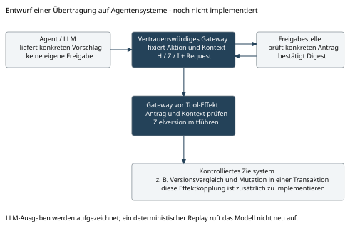

# 4 Anwendungen außerhalb der Repository Governance

## 4.1 Gemeinsames Anwendungsprinzip

Die Lösung ist dort technisch interessant, wo zwischen der Vorbereitung einer zustimmungspflichtigen Aktion und ihrem tatsächlichen Effekt relevante Veränderungen auftreten können. Voraussetzung ist ein bestimmbarer Kontext, eine definierte Zustandsprojektion und ein kontrollierter Ausführungspfad. Die folgenden Anwendungsformen sind technische Übertragungsentwürfe. Mit Ausnahme des lokalen Governance-Demonstrators sind sie noch nicht implementiert oder experimentell nachgewiesen.

| Anwendungsfeld | Mögliche gebundene Daten | Erwarteter Nutzen und zusätzlicher Bedarf |
|---|---|---|
| KI-Agent mit Werkzeugzugriff | Konkreter Toolaufruf, Zielobjektversion, akzeptierter Verlauf, Adapterkonfiguration | Veraltete Zustimmung zum Toolaufruf erkennen; Zielsystem muss bedingten Effekt unterstützen |
| Zusammenarbeit mehrerer Agenten | Auftragszustand, delegierte Rolle, freigegebener Teilplan, Implementierungsstand | Kontextwechsel zwischen Agenten sichtbar machen; Identität und Delegation zusätzlich regeln |
| Freigabe eines KI-Modells | Modelldigest, Evaluationsnachweise, Einsatzprofil, Serving-Konfiguration | Release an genau die geprüfte Kombination binden; echte Deployment-Kopplung ergänzen |
| Infrastrukturänderung | Konkreter Änderungsplan, Ressourcenstände, Ausführungskonfiguration | Abweichung zwischen geprüftem Plan und Zielzustand erkennen; Cloud-/Cluster-Adapter erforderlich |
| Datenmigration | Schemafassung, freigegebene Transformation, Dataset-Version | Freigabe für eine andere Datenbasis zurückweisen; Transaktion oder Snapshot im Ziel erforderlich |
| Automatisierte Sicherheitsreaktion | Befundstand, betroffene Ressource, ausgewählte Reaktion, Richtlinienversion | Zustimmung an aktuelle Lage binden; Nebenwirkungen und Rücknahme eigenständig modellieren |
| Produktionssteuerung | Version eines Arbeitsauftrags, Maschinenkonfiguration, zulässiger Parametersatz | Einsatz überholter Parametergenehmigung erkennen; Echtzeit- und Sicherheitsanforderungen separat nachweisen |

## 4.2 KI-Agent mit zustimmungspflichtigem Werkzeugaufruf

Ein Agent schlägt beispielsweise eine Änderung an einem Kundendatensatz vor. Die Person sieht den konkreten Zielschlüssel, die bisherigen Werte und den vorgeschlagenen Patch. Während der Freigabepause verändert ein anderer Prozess den Datensatz oder der Agent überarbeitet seinen Plan. Eine unveränderte allgemeine Zustimmung zum Vorgang darf dann nicht automatisch den neuen konkreten Schreibaufruf autorisieren.

Für eine Übertragung würde der Agent zunächst nur einen typisierten Vorschlag erzeugen. Ein vertrauenswürdiges Gateway bildet den konkreten Aktionskörper A, nimmt die Objektversion in den relevanten Zustand auf und berechnet den gebundenen Antrag. Nach der Zustimmung prüft das Gateway den Kontext erneut und führt ausschließlich die gebundene Operation aus. Es übergibt dem Zielsystem beispielsweise eine erwartete Version für eine bedingte Änderung. Ohne eine solche Zielbedingung bleibt zwischen lokaler Prüfung und externem Effekt ein offenes Zeitfenster.

Die Grenze zwischen Agent und Gateway ist wesentlich: Das Sprachmodell darf den finalen Antrag nicht nachträglich austauschen, seine eigene Freigabe erzeugen oder den kontrollierten Adapter umgehen. Die Plattform muss dafür Zugangsdaten und direkte Werkzeugrechte entsprechend kapseln. Der Prototyp implementiert eine solche Agentenplattform noch nicht.

Nichtdeterministische LLM-Ausgaben werden für einen Replay als aufgezeichnete Eingaben oder konkrete ausgewählte Aktionen behandelt. Der Replay darf nicht voraussetzen, dass ein erneuter Modellaufruf dieselbe Antwort erzeugt. Ein Modellname allein bindet zudem kein unveränderliches Modellartefakt, wenn ein externer Anbieter unter demselben Namen die Implementierung ändern kann.

Die Kontextbindung bewertet weder die inhaltliche Qualität eines Modellvorschlags noch verhindert sie jede Prompt Injection. Eine fehlerhafte, aber unverändert freigegebene Aktion kann weiterhin fehlerhaft sein. Sie unterstützt die technische Trennung von Vorschlag, Zustimmung und tatsächlich zugelassenem Effekt.

## 4.3 Mehrere kooperierende Agenten

Ein planender Agent könnte eine Aufgabe zerlegen, ein zweiter einen Patch erzeugen und ein dritter Testergebnisse bewerten. Eine menschliche Freigabe müsste dann die tatsächlich zur Ausführung ausgewählte Variante und den zugehörigen Zustand binden. Neue Testergebnisse oder ein Ersatzpatch müssten den alten Antrag ungültig machen, soweit sie zum gebundenen Kontext gehören.

Diese Ausführungsform erfordert zusätzlich ein überprüfbares Delegationsmodell. Der bisherige feste synthetische Owner reicht dafür nicht. Agentenidentitäten, Auftragsscope, delegierte Befugnisse und die maximale Wirkung jedes Teilauftrags müssten ausdrücklich modelliert werden. Mehrere Agenten benötigen nicht zwingend mehrere Ledger; ihre Ausführung könnte zunächst über ein gemeinsames vertrauenswürdiges Gateway serialisiert werden. Ein verteilter Ausbau ist eine weitere Architekturentscheidung.

## 4.4 KI-Modellfreigabe und MLOps

Für einen Modellrelease könnte die Zustandsprojektion die geprüfte Modellversion, Evaluationsdatensätze, relevante Testergebnisse und das freigegebene Einsatzprofil enthalten. I könnte den tatsächlichen Serving-Adapter, die Vor-/Nachverarbeitung und eine festgelegte Konfiguration binden. Die konkrete Aktion wäre beispielsweise die Aktivierung genau eines bestimmten Modellartefakts in einem benannten Ziel.

Eine solche Bindung wäre hilfreich, wenn nach der Prüfung neue Evaluationsergebnisse eintreffen oder eine andere Vorverarbeitung ausgerollt wird. Sie ist jedoch kein Beweis für Modellqualität, Fairness oder Sicherheit. Die reale Modellbereitstellung müsste bedingt und nachvollziehbar mit der Freigabe gekoppelt werden; der lokale Artefaktschreibvorgang des Prototyps genügt dafür allein nicht.

## 4.5 Planbasierte Änderungen und Datenverarbeitung

Bei Infrastruktur-as-Code oder einer Datenmigration besteht ein ähnliches Muster: Geprüft wird ein konkreter Plan für einen bestimmten Ausgangszustand. Die spätere Ausführung muss feststellen, ob Plan und Ziel weiterhin zusammenpassen. Die H-/Z-/I-Bindung kann die erwartete Grundlage explizit machen. Eine Datenbank könnte den Versionsvergleich und die Mutation in derselben Transaktion ausführen; bei einem Cloud-API-Aufruf wären bedingte Updates oder ein eigens entworfenes Ausführungsprotokoll erforderlich.

## 4.6 Eignung und Grenzen der Übertragung

Die Bindung ist besonders sinnvoll bei zustandsabhängigen, prüfbaren und kontrolliert auslösbaren Operationen. Weniger geeignet ist der unveränderte Prototyp für unkontrollierbare externe Effekte, harte Echtzeitvorgaben oder Akteure, die den gemeinsamen Ausführungspfad umgehen dürfen.

Bereits vorhandene Agentenframeworks kennen Freigabeunterbrechungen und Wiederaufnahme. LangGraph dokumentiert beispielsweise Unterbrechungen für menschliche Eingaben und die Bedeutung idempotenter Seiteneffekte bei erneut ausgeführten Knoten. Diese Funktionen sind als bekannte Vergleichsmechanismen zu berücksichtigen. Daraus folgt weder eine Integration des vorliegenden Prototyps in LangGraph noch eine Aussage, dass andere Frameworks die gesamte hier beschriebene Merkmalskombination besitzen oder nicht besitzen. [E5]
